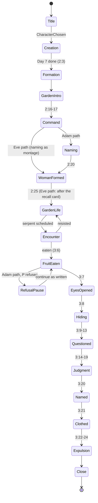

# Adam and woman in the garden of Eden: game design and technical plan

Status: design for Jeffrey Palermo, 2026-10-08. Jeffrey decided the earlier open questions on that day; they are
recorded in section 12 and worked into the sections below. Planning only: no repository, no code and no Azure
resource exists yet. A developer session can start from section 10, slice S0.

**Title.** The game and the system are titled **"Adam and woman in the garden of Eden"**. That is the title on the
title screen, in the page `<title>`, in the web app manifest and in every text a player sees. The technical names
stay short: slug `adameve`, repository `clearmeasure-aisf-sample-apps/adameve-app` (branch `master`), deployable
`web`, namespaces `AdamEve.*`. The title also fits the text, which calls her "the woman" until Genesis 3:20.

The game is a browser role-playing game for readers aged about 11 to 14. It tells Genesis 1 to 3 in the King James
Version. The player is Adam or the woman (named Eve in 3:20). They watch the days of creation, are created, live in
the garden of Eden and are tempted. The game goes on for as long as the player resists. When the player eats the
fruit, the game plays the rest of Genesis 3 to its last verse and ends.

It is the first application of the new demo system `adameve`, built with the demo-environment kit. The app
repository is `adameve-app` on branch `master`, with `app.source: repository` and `deployable.hosting: own` on Azure
Static Web Apps Free. There is no database, and the environments are `tdd` and `prod`.

> **Changed 2026-10-09 (D17, section 12).** Jeffrey decided that the game runs on Azure Container Apps express, in
> the environment the system owns, instead of Static Web Apps Free. Sections 0, 7.5, 7.6, 8, 9, 10 and 11 carry a
> note where that changed them. Where an older sentence elsewhere still names Static Web Apps, its emulator or
> `staticwebapp.config.json`, section 7.6 says what does that work now.

**A fleet of its own.** The system belongs to a new, separate fleet: its own fleet platform repository, copied from
the demo-environment kit, with the owner session "Adam and woman in the garden of Eden". It is not part of the
existing Clear Measure demo fleet. It uses the same Azure subscription and the same Octopus instance
(`https://clearmeasure.octopus.app`). The design depends only on these:

- the kit's contracts: the hosting-`own` contract of `reference.md`, the build-facts fields of decisions 0007, 0019
  and 0028, and the nodes-file rules;
- facts the kit documents about Azure;
- the subscription's shared quotas (section 7.6).

---

## 0. Decisions at a glance

| Topic | Decision |
|---|---|
| Scripture source | `content/kjv-genesis-1-3.txt`, the file Jeffrey supplied, committed byte for byte. It is the only source of quoted Scripture and is parsed at run time from an embedded resource. A test pins its SHA-256, and a round-trip test proves the parser loses nothing |
| Scripture versus game text | Three kinds of text that never look alike. **Scripture**: serif, parchment card, always with its reference. **Narration**: sans-serif, plain panel, no reference. **Speech**: a speech bubble with the speaker's name, no reference. The LORD God and the serpent speak **only** Scripture, and a content test enforces this |
| Modesty (hard rule M1) | Before 3:7, the private parts of Adam and the woman are always turned away from the viewer or covered (hair, foliage, plants, props), in every sprite frame, pose, animation frame, portrait, cutscene shot and camera angle. From 3:7 the fig-leaf aprons cover; from 3:21 the coats of skins. Characters are cut-out rigs with occluders bound to the body. A build test checks pixel coverage, the running game checks every frame, and a human review checks every asset (section 1, section 5.6) |
| Assets | All generated: art, sprites, backgrounds, the fruit, music and sound. Tool-agnostic specs live in the repository, with one style sheet, provenance and licence for each asset, and a review before commit (section 5.5) |
| Rendering | HTML canvas 2D through one small JavaScript module, driven by C# with `[JSImport]`/`[JSExport]`. All text, dialogue and menus are Blazor DOM components over the canvas. No game library |
| Architecture | Onion layers. `AdamEve.Core`: story state machine and world rules, no UI and no I/O. `AdamEve.Content`: KJV parser, story, map, rig and asset loaders. `AdamEve.Client`: Blazor WebAssembly standalone, published as static files. There is no server for the game: no game code runs outside the browser. *Changed 2026-10-09 (D17):* a fourth, outermost project, `AdamEve.Host` (ASP.NET Core), serves those static files and answers the health paths (section 7.6) |
| Hosting | *Changed 2026-10-09 (D17), replacing Static Web Apps Free:* Azure Container Apps express. One container app per environment (`ca-adameve-tdd-web`, `ca-adameve-prod-web`) in the express environment the system owns (`cae-adameve`, resource group `rg-adameve-apps`, Central US), scaled to zero when nobody plays. The image holds `AdamEve.Host`, which serves the published client with the brotli files the publish step wrote, the headers, CORS and the fallback, and answers `/_healthcheck`, `/alive`, `/_version` and `/_build` (section 7.6). The payload budget of 3.0 MB on first load is a quality gate for phones, not a bandwidth necessity |
| Rollback | *Changed 2026-10-09 (D17):* no archive. The image of every released version stays in the system's registry, its tag locked, and `deploy.ps1` deploys any version by its tag (section 9.2). The storage archive of D12 is not needed |
| Saves | `localStorage` only. No account, no name, no free text, no analytics, no cookies, no request to any other origin |
| Tests | Unit: NUnit, bUnit and SkiaSharp image checks. Integration: scripted headless playthroughs, the published site served by its own host as a process (*Changed 2026-10-09 (D17):* not the Static Web Apps CLI emulator), and Pester. Full-system: Playwright on desktop Chromium with a keyboard, Pixel 7 (Chromium, touch) and iPhone 13 (WebKit, touch), all headless, against the same process |
| Delivery | `build.yml` is named `Build`, calls only `./PrivateBuild.ps1 -CI`, keeps the artifacts `deploy-package` and `container-image` and has a job `Build result`. *Changed 2026-10-09 (D17):* the release pushes the image to the system's registry, and `deploy.ps1` applies the app's own Bicep deployment stack, which names the image of the version; there is no upload and no deployment token. `verify.ps1` checks the site and writes the nodes file |

---

## 1. Audience and tone

**Readers.** Ages 11 to 14, reading on their own. The KJV text is quoted exactly as written and reads at about a
grade 8 to 10 level, so the game supports it instead of simplifying it:

- **Glossary taps.** Hard KJV words are underlined in a Scripture card. A tap or Enter shows a short definition in
  narration style, never inside the card. The starting list:
  - *firmament* (the sky); *subtil* (crafty, cunning); *an help meet* (a helper suitable for him);
  - *compasseth* (goes around); *bdellium* (a precious resin or stone); *onyx*; *enmity* (hostility);
  - *beguiled* (tricked); *hearkened* (listened to); *sanctified* (set apart as holy); *cleave* (hold fast);
  - *Cherubims* (heavenly beings; the KJV spelling is kept); *meat* (food); *thereof*; *thee/thou/thy*.

  The glossary is game text and must never contradict the verse.
- **Narration** written by the game aims at grade 5 to 6. A unit test computes the Flesch-Kincaid grade of every
  narration string and fails above 7.0.
- **Text size** is S, M, L or XL, with an 18 px minimum body size and a 1.5 line height. Contrast is WCAG AA or
  better. Text never scrolls on its own: the player advances it.

**Tone.** Reverent, warm and plain. The game does not preach and does not joke about God, the command or the fall.
The humour comes from the animals and the garden. Each story beat states what the text states and leaves the
meaning to the reader, a parent or a teacher. The optional "Think about it" prompts and the "Look closer" note
(decision D8) ask questions; they never give doctrinal answers.

**God** (D5). God is never shown as a figure. The presence of God is a warm, moving light and a voice. The Scripture
card's speaker label is "God" in chapter 1 and "The LORD God" from 2:4, following the text. In 3:8 the voice
"walking in the garden" is light passing through the trees, with the leaves stirring.

**Modesty: hard rule M1** (D4). The game cannot clothe Adam and the woman before 3:7 without muddling the teaching of
the fig-leaf aprons and the coats of skins. So:

| Period | What covers |
|---|---|
| From their formation (2:7, 2:22) until 3:7 | The private parts (the pelvic area of both; also the chest of the woman) are **always turned away from the viewer or covered by something opaque**: long hair, the character's own arm in a pose, foliage, a nearby plant, tall grass, reeds or water surface, or a scene prop. This holds in every sprite frame, pose, animation frame, portrait, cutscene shot and camera angle, at every zoom |
| 3:7 to 3:21 | The fig-leaf apron covers the pelvic area; the woman's chest stays covered by hair, foliage or pose under M1 |
| From 3:21 | The coats of skins cover both |

How M1 is met by construction:

- **Facings.** In the world (a 3/4 top-down view) a character has 8 facings. Only the three back facings (N, NE,
  NW) count as "turned away". Every other facing requires an occluder.
- **Occluders that move with the character.** Before 3:7 each character carries a *companion foliage* group: the
  garden's own ferns, flowers and grasses at waist height. It is drawn in the layer in front of the character,
  bound to the rig's hip bone, so it moves, turns and sways with them and parts as they walk. It is plants of the
  garden, never a garment: it is not drawn as worn, and it is gone at 3:7 when the aprons appear. In rivers, reeds
  and the water surface take its place.
- **Hair.** The woman's long hair is a front layer of her rig that covers the chest zone in every facing that is not
  turned away.
- **No anatomy, even under cover.** The base body is a smooth, simple shape with no anatomical detail. Covering it
  is the rule; the blank body is defence in depth.
- **Portraits** are head and shoulders, cropped above the chest line, with the woman's hair over her shoulders.
- **Cutscenes and lying poses.** 2:21 (deep sleep) has Adam lying turned away, with plants in front. Every shot
  declares its framing, and the same coverage check applies (section 5.6).
- **Fail closed.** Before 3:21, if the renderer meets a character frame without a valid concealment record, it draws
  the full default foliage cluster in front of the character and reports an error. Tests treat that error as a
  failure.

**Amended 2026-10-10 (D18; confirmed by Jeffrey on 2026-10-10 ("All good", then "Do it" to promoting it)).** Jeffrey decided: "Make
characters not have leaves covering. Woman has long hair covering breasts" (section 12, D18). The companion foliage
and the default foliage cluster are removed. Modesty now holds like this:

- **The figures are never anatomical.** No rig part, in any frame, facing or variant, draws or suggests genitals,
  buttocks detail, nipples or breasts. The pelvic region of both figures is a smooth, featureless continuation of
  the body shape, as on a simple doll or a wooden figure. The woman's chest is a plain torso shape with no
  modelling: her body is the same seven blocks as Adam's. Nothing is added to make a figure "more realistic".
- **The woman's long hair** covers her chest in every facing, pose and animation frame in which the chest would face
  the viewer. It is bound to the head, in the hair colour of D7, and ends at the waist, above the pelvic zone.
- **Fail closed** now means: a figure whose frame does not pass the checks of section 5.6 is not drawn at all, and
  the frame is counted and reported.
- The fig-leaf aprons (3:7) and the coats of skins (3:21) stay in the rigs as they were: they are Scripture, not
  the companion foliage. They are not shown yet.
- In the table above, read the first row as: the pelvic area of both is the body's own smooth shape with nothing
  drawn in it; the chest of the woman is turned away from the viewer or covered by her hair.

**No gore, no fear for its own sake.** 2:21 (the rib) is light at the sleeping man's side; nothing anatomical is
shown. In 3:21 (the coats of skins) the coats appear in the light; no animal is killed on screen. 3:24 is majestic,
not frightening.

**The serpent** (D6). "More subtil than any beast of the field" (3:1): crafty and beautiful, neither a monster nor a
mascot.

- Before the curse it moves upright on four small legs, because 3:14 ("upon thy belly shalt thou go") implies it
  moved another way before.
- Its scales are iridescent green and gold and shift colour to match the surroundings. It has half-closed amber eyes
  and a smooth, slow way of moving. Its music is a low clarinet figure.
- It never chases, attacks or frightens; its danger is its words.
- The game calls it "the serpent", as the text does, and names it nothing further.
- At 3:14 its legs fade and it slides away into the dust.

**Children's privacy.** The game asks for and stores no personal data. It has no account, no free-text entry, no
analytics, no advertising and no third-party fonts or scripts, and it makes no request outside its own origin. The
built-in authentication routes of Static Web Apps are closed (`/.auth/*` answers 404), so no cookie is ever set
(since 2026-10-09, D17, the host has no such routes at all, and sets no cookie). A
short "For parents and teachers" page says all this, including that the art and music were generated and reviewed
(section 5.5).

---

## 2. Story beats mapped to the text

### 2.1 The canonical source and the faithfulness rules

The source is the file Jeffrey supplied (`kjv-genesis-1-3.txt`). Facts measured from it on 2026-10-08:

| Fact | Value |
|---|---|
| Size | 11,078 bytes, UTF-8 **without** a byte-order mark, LF line endings, one trailing newline, 252 lines |
| Title line | `The First Book of Moses: Called Genesis`, followed by two blank lines |
| Layout | Paragraphs separated by one blank line, wrapped at 70 characters or fewer |
| Verse markers | `C:V` followed by a space, 80 in all: 31 in chapter 1, 25 in chapter 2, 24 in chapter 3. Each paragraph starts with one. Markers in the middle of a paragraph: 1:15, 1:18, 2:5, 2:12, 2:17, 2:22, 3:2, 3:3, 3:5, 3:10, 3:12, 3:15, 3:18, 3:19, 3:23. The marker of **3:5 ends a line** (line 189), so its text starts on the next line |
| Characters | ASCII except one: the curly apostrophe U+2019 in "wife’s" (3:20). No digits occur in verse text, so `\d+:\d+` is always a marker |
| SHA-256 | `b2eae7f0b5db545ca31502ef5a2f1bcb6853eee763a80a48553c13b876600e6f` |

Rules every piece of content follows:

1. **Scripture is quoted only from this file, character for character.** That includes "subtil", "Cherubims",
   "an help meet", "the LORD" in capitals, and "wife’s" with U+2019. A quotation is a verse reference plus an optional
   exact span. Story data never holds a copy of verse text: it holds `{ "ref": "3:9", "quote": "Where art thou?" }`,
   and the validator proves the quote is a substring of verse 3:9 as parsed.
2. **Nothing paraphrased is shown as Scripture.** Narration and speech never use the Scripture card style, and a
   Scripture card shows nothing but the parsed text and its reference.
3. **Game text never contradicts the verses.** Jeffrey reviews narration and speech against the beat's verses
   (D8; the review checklist is in the content README). The structural rules are tested (section 8).
4. **The LORD God and the serpent speak only Scripture.** The validator refuses a speech or narration line whose
   speaker is either of them.
5. **The serpent speaks only to the woman** (3:1, 3:4). It never addresses Adam on either path.
6. **The command (2:16-17) is spoken to the man**, before the woman exists.
7. **Both eat in 3:6.** The non-player character always eats when the story reaches 3:6.
8. **The fruit is never called an apple**, in the text or in the game. The game calls it "the fruit of the tree".
   The tree's user-interface label follows 2:17: "the tree of the knowledge of good and evil". The text of 2:9 reads
   "the tree of knowledge of good and evil", and the Scripture card for 2:9 keeps that wording.

**Names in the user interface** (D3). The text calls the man "the man" until 2:19, where "Adam" first appears. It
calls the woman "a woman" at 2:22 and names her "Woman" at 2:23. She is "the woman" (and "his wife") until 3:20,
"And Adam called his wife’s name Eve". The game follows the text:

| Where | Man's label | Woman's label |
|---|---|---|
| Title screen and character select (outside the story) | Adam | The woman, as in the game's title, with a small line beneath: "named Eve in Genesis 3:20" |
| 2:7 to 2:18 | The man | not yet created |
| 2:19 to 3:19 | Adam (the label changes during the naming of the animals) | Woman, from 2:22 |
| 3:20 to the end | Adam | Eve. The label changes on screen as the verse is shown, so the player sees the naming happen |

Scripture cards always show the text as written, whatever the label says. In this document, "Eve path" and "Eve
NPC" are technical names for the woman's path and the woman as a non-player character.

### 2.2 Beat list

Each beat is one state of the story machine (section 3). "P" marks the player's action.

| # | Beat | Verses | What happens | Adam path | Eve path |
|---|---|---|---|---|---|
| B0 | Title, character select | none | Title "Adam and woman in the garden of Eden". Choose Adam or the woman, text size and sound. The "Read Genesis 1-3" reader is always available | | |
| B1 | Day 1 | 1:1-1:5 | Darkness; P taps or presses to **reveal** the light, which spreads. The player watches and does not create: each interaction turns the page, and the card says "And God said" | same | same |
| B2 | Day 2 | 1:6-1:8 | P swipes or presses to reveal the firmament dividing the waters | same | same |
| B3 | Day 3 | 1:9-1:13 | Dry land rises; grass, herbs and fruit trees sprout under the player's cursor | same | same |
| B4 | Day 4 | 1:14-1:19 | Sun, moon and stars appear in turn. In the source, 1:14-1:15 and 1:17-1:18 are each one paragraph; the cards still show one verse each | same | same |
| B5 | Day 5 | 1:20-1:23 | Whales and fish fill the sea; birds burst into the sky | same | same |
| B6 | Day 6 | 1:24-1:31 | Animals appear. 1:26-1:28: two figures of light, far away, under M1; "very good" | same | same |
| B7 | Day 7 | 2:1-2:3 | Stillness; no interaction; a rest screen | same | same |
| B8 | Mist and formation | 2:4-2:7 | Mist waters the ground. The man is formed of red-brown dust; the breath of life comes as light; his eyes open | **P is formed**: first control, movement tutorial | Cutscene, with narration "Before you were made..." |
| B9 | The garden planted | 2:8-2:14 | The camera sweeps the garden: the two trees in the midst, the river and its four heads | P explores the central glade | Cutscene |
| B10 | Dress and keep | 2:15 | First tasks (water a sapling, clear a branch) | P plays them | Montage |
| B11 | The command | 2:16-2:17 | Light and voice; the Scripture card for 2:16-17, spoken to the man | P stands before the light; no choice | Cutscene, framed "Before you were made, the LORD God commanded the man:" |
| B12 | Not good to be alone | 2:18 | Card | | |
| B13 | Naming the animals | 2:19-2:20 | Mini-game (section 3.5): the player names the **kind** of each animal. "The man" becomes "Adam" at 2:19. At the end the animals stand in pairs, and "for Adam there was not found an help meet for him" | P names each animal's kind | Short montage, then B16 |
| B14 | Deep sleep, the woman made | 2:21-2:22 | The light rests at the sleeping man's side; nothing anatomical is shown | The screen dims as P sleeps; P wakes and the woman is brought | **P is formed**: the light gathers, eyes open, first control |
| B15 | "Bone of my bones" | 2:23 | Adam speaks the verse | P speaks it (press to speak) | Adam NPC speaks it to P |
| B16 | One flesh, not ashamed | 2:24-2:25 | Narrator cards, under M1 | | Then narration: "The man tells you what the LORD God commanded him." The 2:16-17 card follows as a **recall card**, labelled "The LORD God's command to the man (Genesis 2:16-17)". Nothing is added, in particular not "neither shall ye touch it", which is the woman's own wording in 3:3 |
| B17 | Life in the garden | none new | The open loop (section 3.4), which lasts as long as the player resists | | |
| B18 | Serpent encounters | 3:1-3:5 | Escalating encounters (section 3.3) | The serpent speaks to Eve NPC; P intervenes or not | The serpent speaks to P |
| B19 | The fruit is eaten | 3:6 | "took of the fruit thereof, and did eat, and gave also unto her husband with her; and he did eat" | Eve NPC eats and offers; P eats or refuses (section 3.2) | P eats (hold to confirm); Adam NPC, with her, eats |
| B20 | Eyes opened | 3:7 | Colours shift; mini-game: gather and sew fig leaves; the aprons appear and the companion foliage leaves | both | both |
| B21 | Hiding | 3:8 | The voice "walking in the garden in the cool of the day" (the only place the game uses that phrase); both hide among the trees | P hides | P hides with Adam NPC |
| B22 | "Where art thou?" | 3:9-3:12 | The LORD God calls unto Adam. Hiding never succeeds: wherever the player hides, the light finds them and the player steps out | P speaks 3:10 and 3:12 (press to speak) | Adam NPC answers |
| B23 | The woman questioned | 3:13 | | Eve NPC answers | P speaks 3:13 |
| B24 | The serpent cursed | 3:14-3:15 | The serpent's legs fade; it goes on its belly | | |
| B25 | Unto the woman | 3:16 | Card only, over a gentle, still image | | |
| B26 | Unto Adam | 3:17-3:19 | Thorns and thistles sprout at the garden's edge; the ground darkens | | |
| B27 | Eve named | 3:20 | The label changes to "Eve" | | |
| B28 | Coats of skins | 3:21 | Light; coats appear on both | | |
| B29 | Sent forth | 3:22-3:23 | The player walks east out of the garden | | |
| B30 | Cherubims and the sword | 3:24 | At the east of the garden: Cherubims, tall winged beings of light (not cupids), and a ring-shaped flaming sword turning slowly every way before the tree of life | | |
| B31 | Close | 3:21, 3:15 | The closing card (section 4, D2); journal summary; "Play as Adam" or "Play as the woman"; "Read Genesis 1-3" | | |

The **reader** ("Read Genesis 1-3") shows all 80 verses from the parsed file, by chapter, with glossary taps. It is
cheap to build once the parser exists, and it is the most faithful teaching tool in the game.

---

## 3. Player paths and the state machine

### 3.1 Story machine

The story is a pure function in `AdamEve.Core`:

```
StoryStep Apply(StoryState state, StoryEvent e)  ->  (StoryState next, IReadOnlyList<Effect> effects)
```

- `StoryState`, an immutable record saved as JSON, holds:
  - `Character` (Adam | Woman), `Chapter` (enum, below), `Beat`, `GardenDay`;
  - `SerpentTier` (0-5), `EncountersResisted`, `EveTemptation` (Adam path, 0-100), `AdamRefusals`;
  - `NamedAnimals` (animal id → chosen kind-name id), `Journal` (set of entry ids), `Flags`;
  - `RandomSeed` and `RandomStep` (deterministic randomness);
  - `Labels` (man, woman) and `Covering` (None | Aprons | Coats, which drives M1).
- `StoryEvent`: `CharacterChosen`, `DialogueAdvanced`, `ChoiceMade(id)`, `HoldConfirmed(id)`, `ReachedArea(id)`,
  `TaskCompleted(id)`, `DayEnded`, `MiniGameCompleted(id, result)`, `NpcArrived(id)`.
- `Effect`: `ShowScripture(ref, span?)`, `ShowNarration(id)`, `ShowSpeech(speaker, id)`, `OfferChoices(list)`,
  `PlayCutscene(id)`, `StartMiniGame(id)`, `MoveNpc(id, target)`, `SpawnSerpent(area)`, `SetLabel`,
  `SetCovering`, `PlayCue(id)`, `UnlockArea(id)`, `AddJournal(id)`, `Save`.

Chapters:



`GardenLife` and `Encounter` repeat for as long as the player resists. Nothing else returns.

### 3.2 The two paths

**Eve path (the player is the woman).**

| Step | Serpent (Scripture only) | Player choices |
|---|---|---|
| Question | 3:1 "Yea, hath God said, Ye shall not eat of every tree of the garden?" | (a) Answer: the player speaks 3:2-3 as Scripture. (b) Walk away. (c) Go to Adam: the NPC walks with her |
| The lie | 3:4 "Ye shall not surely die:" and 3:5 | (a) Turn away. (b) Look at the tree |
| Looking | None. The fruit glows brighter. Narration describes only what the player sees ("The fruit shines in the light.") and does not paraphrase 3:6 | (a) Turn away. (b) **Take and eat**: a press-and-hold button that takes one second. A short tap on a phone is never enough |

Eating starts B19: the 3:6 card; the woman gives to her husband "with her"; Adam NPC eats (rule 7). From tier 3 on,
Adam NPC stands near her, silent, as 3:6 has him "with her". He does not intervene, because the text does not
record him doing so.

**Adam path (the player is the man).**

- The serpent appears only when Eve NPC and Adam are within 6 tiles of each other ("with her"). It speaks only to
  her. Eve NPC answers with 3:2-3 at the tiers where she answers.
- Eve NPC carries `EveTemptation` (0-100). Each serpent line adds `gain(tier)`: 12, 16, 20, 24 or 28. Each of
  Adam's interventions subtracts:

| Intervention | Effect |
|---|---|
| Remind her of the command | The recall card for 2:16-17, "Adam remembers the LORD God's command". -30 |
| Lead her away | Eve NPC follows Adam out of the glade and the encounter ends. -20, and the serpent leaves |
| Stand between her and the tree | -15 for each serpent line it lasts |
| Say nothing | 0. A narration line notes that Adam was silent |

- When `EveTemptation` reaches 100 by the tree, Eve NPC takes and eats (the first half of 3:6), turns and holds the
  fruit out to Adam. The player chooses **Eat** (hold to confirm) or **Refuse**.
- **Adam refuses** (D1: continue the story as it is written):
  1. Each refusal shows the 2:17 recall card. Eve NPC keeps holding out the fruit. The garden stops: no new day, no
     task, no music.
  2. After the third refusal, or when the player asks, a narration card says: "You chose not to eat. Genesis 3:6
     records what happened next:" followed by the Scripture span "and gave also unto her husband with her; and he
     did eat."
  3. Two buttons: **Continue the story as it is written**, where Adam eats in a cutscene the player watches and does
     not choose, or **Save and return to the title**, where the save stays at this point.
  4. The close names the variant: "You refused. The Bible records that Adam ate."

**Who knows the command.** On the Adam path the player hears it in B11. On the Eve path the player sees B11 framed
as "before you were made" and receives the command from Adam in B16 as a recall card. 3:3 is the woman's own
wording, which adds "neither shall ye touch it", and the game quotes 3:3 exactly. Touching the tree does nothing
(D15). The "Look closer" note (narration, D8) says only: "Compare what the woman said in Genesis 3:3 with the
command in Genesis 2:17."

### 3.3 Serpent encounters: escalation

The serpent's words are the KJV lines alone. Escalation comes from **where** it appears and **how much** it says:
how close to the tree, how much of 3:1-5, how bright the fruit glows, and how often it comes.

| Tier | Earliest garden day | Where | What the serpent says | Fruit glow |
|---|---|---|---|---|
| 1 | 2 | Far from the tree (a river bank), in the woman's path | 3:1 only | low |
| 2 | 3 | At the edge of the central glade | 3:1, then 3:4 if answered | medium |
| 3 | 5 | Beside the tree | 3:1 to 3:5 | high; the tree hums |
| 4 | 8 | Beside the tree, appearing when the woman passes within 10 tiles | 3:4-5 at once | high; light reaches her |
| 5 (stays) | 12 | As tier 4, and also during tasks in the glade; it follows her a few steps | 3:4-5; on later visits 3:1 again | pulsing |

- Encounters happen every 1 to 2 garden days (seeded). They never happen on a rest day (every 7th garden day,
  2:2-3) and never twice in one day.
- Resisting earns no points for "beating" the serpent. The serpent leaves, the garden is still for a moment, a
  journal entry is added ("The serpent spoke, and you turned away"), and the count of days in the garden rises.
  Resisting keeps the garden open; that is the reward.
- After 5 resisted encounters the tier stays at 5. The temptation never stops, and the player can still resist
  forever.

### 3.4 Life in the garden: what "keep playing as long as you resist" means

A garden day is about 8 minutes of play, or less if the player rests at the resting place after the day's tasks.

- **Dress and keep (2:15).** A board shows three tasks a day, drawn from:
  - carry water from a river to saplings;
  - clear fallen branches;
  - plant seeds (1:29, "herb bearing seed");
  - lead a lost lamb home;
  - gather green herbs and feed the animals (1:30: the animals eat green herb, so feeding is herbs, never meat or
    fruit).
- **Eat freely (2:16).** Every other tree may be visited and its fruit gathered. Real fruits (fig, date, olive,
  grape, pomegranate) are fine on those trees. Only the forbidden fruit is unlike anything real.
- **Explore the four heads (2:10-14).** Regions open over the days:
  - Pison toward Havilah, where the player gathers gold, bdellium and onyx for the journal (2:11-12);
  - Gihon toward Ethiopia;
  - Hiddekel, flowing toward the east of Assyria;
  - Euphrates.
- **The garden journal** holds:
  - verse cards, collected when the player sees what a verse describes (the onyx stone unlocks 2:12);
  - each animal with the kind-name Adam gave it, and its meaning;
  - plants and places;
  - a completion meter.
- **Rest day.** Every 7th garden day has no tasks and no serpent, and the reader opens on 2:1-3.
- **The other character.** The NPC follows when near, helps with tasks, has idle animations, and says short
  game-written lines in speech bubbles ("The lamb wandered toward the river."). It calls the animals by the
  kind-names Adam gave them ("The pachyderm is at the river.").
- **The tree of life** stands in the midst, beautiful and not interactive (D14). Narration: "The tree of life stands
  in the midst of the garden."

### 3.5 Mini-games

| Mini-game | Verses | Play |
|---|---|---|
| Revealing creation | 1:1-2:3 | One gesture or key press a day; each reveal shows its verse card. About 3 minutes; can be skipped after a first completion |
| Naming the animals (Adam path) | 2:19-2:20 | See below |
| Learning the names (Eve path) | after 2:23 | Adam NPC tells her the kind-names he gave (game speech). The player matches each animal to its kind-name. Kind-names are unique across all animals, so every match has exactly one answer |
| Fig leaves | 3:7 | Gather leaves from the fig tree, then a short tap or press sequence to sew them; the aprons appear |
| Hiding | 3:8-3:9 | The player can hide behind any tree. The light finds them wherever they are, and the player must step out. There is no winning this |
| Walking east | 3:23-3:24 | The player walks out of the gate; the camera turns back to the Cherubims |

**Naming the animals: kind-names** (D9). Adam names the **kind** of each animal, not an individual.

- 24 animals of the field, the air and cattle are brought to Adam one by one. There are no fish: the text names
  none. The serpent is not among them, so it is not confused with the animals.
- For each animal the player chooses one of **three kind-names**. All three are real English words for that kind,
  and each has a one-line meaning shown on long-press, hover or the "?" button.
- Every choice is accepted, because "whatsoever Adam called every living creature, that was the name thereof".
- There is no free typing.
- The chosen kind-name becomes the animal's name in the journal and in the NPC's speech.
- On the Eve path, Adam NPC's choices are drawn with the seeded random number generator and saved.

Starting list (the content file holds all 24; Jeffrey reviews the rest under D8):

| Animal | Category (2:20) | Kind-names (meaning) |
|---|---|---|
| Elephant | beast of the field | pachyderm (thick-skinned beast), proboscid (trunked beast), tusker (tusked beast) |
| Pig | cattle | swine (the pig kind), porcine (of pigs), hog (a pig) |
| Wolf | beast of the field | canine (the dog kind), lupine (of wolves), wolfkind (wolves) |
| Lion | beast of the field | feline (the cat kind), leonine (of lions), great cat (a large wild cat) |
| Horse | cattle | equine (the horse kind), steed (a riding horse), courser (a swift horse) |
| Cow | cattle | bovine (the ox kind), kine (cows, a KJV word), neat (old word for cattle) |
| Bear | beast of the field | ursine (of bears), bruin (old name for a bear), ursid (the bear family) |
| Rabbit | beast of the field | leporid (the hare family), coney (old word for a rabbit, used in the KJV), lagomorph (hares and rabbits) |
| Eagle | fowl of the air | raptor (a bird of prey), aquiline (of eagles), bird of prey |
| Camel | cattle | camelid (the camel family), dromedary (one-humped camel), humpback (old nickname) |

`animals.json` has an entry for each animal: `id`, `category`, `rig` or `sprite`, and `kindNames`, three entries of
`{ id, word, meaning }`. The validator checks:

- exactly three kind-names for each animal;
- no kind-name occurs twice anywhere;
- words are lowercase letters and spaces;
- every kind-name has a meaning;
- no kind-name is "apple" or a pet name from the blocklist (such as "spot" or "rex").

---

## 4. Endings and teaching moments

There is one ending: the expulsion, B19 to B31, played in full. Its framing varies:

| Variant | The close says |
|---|---|
| The woman ate first (Eve path) | Shows 3:6 again and "Both ate." |
| Adam path: Adam ate when offered | Same |
| Adam path: Adam refused and continued as written | "You refused. The Bible records that Adam ate (Genesis 3:6)." |

**Teaching moments** are built into the beats instead of added as lectures:

- God asks rather than accuses (3:9, 3:11, 3:13). Optional "Think about it": "God asked 'Where art thou?' Why do you
  think He asked?"
- The blame passes on (3:12, 3:13). The scene shows it with the camera, without comment.
- The consequences are shown as the text gives them, each with its verse card.
- God clothes them (3:21) before sending them out.

**Closing card** (D2). After 3:24, a quiet card holds one line of narration and two Scripture quotations. The
narration reads: "Even as they left the garden, the LORD God had made them coats of skins." The 3:21 card and the
3:15 card follow. The game quotes 3:15 and does not interpret it. Then come the journal summary, "Play as the
other", and "Read Genesis 1-3".

---

## 5. World and art

### 5.1 Map

A 3/4 top-down tile map of 64 × 48 tiles (32 px logical tiles), drawn in the free Tiled editor and exported as
Tiled JSON (`.tmj`). The garden is "eastward in Eden" (2:8). The map's east edge holds the gate where the Cherubims
stand at the end.

```
            N   Spring of Eden (river enters, 2:10)
                         |
  Pison Meadows ---------+--------- Hiddekel Reeds
  (toward Havilah: gold, |          (flows east, toward Assyria)
   bdellium, onyx)       |
                  [ Central Glade ]
          tree of life  *   *  tree of the knowledge
                         |         of good and evil
  Gihon Falls -----------+--------- Euphrates Orchard
  (toward Ethiopia)      |
                   Resting place      East Gate ->  (3:24)
```

| Region | Opens on | Holds |
|---|---|---|
| Central Glade | day 1 | The two trees, the resting place, the fig tree near the trees (used in 3:7) |
| Spring of Eden | day 1 | The river's source; mist effects |
| Pison Meadows | day 2 | Gold, bdellium and onyx collectibles; meadow animals |
| Gihon Falls | day 3 | Waterfalls; birds |
| Hiddekel Reeds | day 4 | Reeds, herons; river crossings (reeds and the water surface are M1 occluders) |
| Euphrates Orchard | day 5 | Fruit trees, cattle |
| East Gate | ending | Closed off until 3:23 |

### 5.2 Art direction

- **Style.** A flat-shaded vector cartoon with soft, thick outlines, warm saturated colours and expressive faces.
  Proportions are about 3 heads tall, older than a toddler's picture book and closer to a modern indie adventure
  game, so middle-school players do not find it babyish. The style is set down in the style sheet (section 5.5),
  never by naming a game, studio or artist.
- **Characters** (D7). Adam and the woman have very light brown skin, like people of Greek or Mediterranean
  ancestry, and dark hair: dark brown to near-black, his short and wavy, hers long, which also serves M1. Their
  figures are simple and smooth, with no anatomical detail (section 1).
- **Animals.** Rounded, friendly, gently comic; shown in pairs after the naming.
- **The fruit of the tree of the knowledge of good and evil** must look like no real fruit:
  - **Shape:** a teardrop twisted into a slow double spiral, about a hand long, hanging point down from a thin,
    silvery stem. No segments and no star cross-section (so it is not a starfruit), no round body (not an apple or a
    pomegranate), no clusters (not grapes or figs).
  - **Skin:** translucent and glassy. Inside, two colours, warm gold and deep violet, slowly swirl around each other
    and never mix.
  - **Light:** a soft inner glow that pulses about once every three seconds, and a faint chime when the player comes
    near. The glow grows with the serpent tier (section 3.3).
  - **Crown:** a ring of fine silver filaments at the stem, which stir with no wind.
  - **The tree:** dark silver bark; leaves silver on one side and nearly black on the other, which flicker as they
    turn.
- **The tree of life.** Tall, with white-gold bark, green-gold leaves and pale glowing blossoms, in a calm, steady
  light. The two trees stand together in the midst (2:9) and must never be confused: one cool and flickering, one
  warm and steady.
- **The Cherubims.** Tall, winged, made of light, their faces hidden in brightness, still. Not baby angels.
- **The flaming sword.** A floating ring of flame-blade turning slowly "every way" before the path to the tree of
  life.
- **No text inside images.** All words are DOM text. Generated images garble letters, and Scripture belongs only in
  cards.

**Art pass, 2026-10-10 (Jeffrey: "Keep going. Need more creative graphics").** Until the generated assets of
section 5.5 exist, all art is drawn by code, and with care: a stylised cut-paper, low-poly look in one family of
colours (warm light, cool shade, greens from gold to teal). The planting of the garden is a fact of the world
(`AdamEve.Core.World.GardenScenery`, from the map and a fixed seed) and changes no rule: only what cannot be walked
on has height. The two trees in the midst follow this section: one tall, warm and steady, one low, cool and
flickering; no fruit is drawn yet and neither is interactive (D14). The pictures of the days of creation are drawn
in the same manner. What code cannot draw well (faces with expression, animals with character, the fruit) waits
for section 5.5.

### 5.3 Characters as cut-out rigs

Adam, the woman, the serpent and the larger animals are **cut-out rigs**, not frame-by-frame sprite sheets:

- A rig is a set of parts on a small skeleton: head, front and back hair, torso, upper and lower arms and legs, and
  the occluder parts.
- The parts are generated from the approved model sheets (section 5.5). Animations are keyframes in JSON (`walk_s`,
  `walk_ne`, `idle`, `kneel`, `sleep`, and so on), and the renderer composes the parts with canvas transforms.
- Rigs keep generated art consistent, because one approved set of parts serves every frame instead of hundreds of
  separately generated frames that drift in style.
- Rigs make M1 controllable. Each rig declares its **concealment zones** (polygons bound to bones: the pelvic zone
  for both, and the chest zone for the woman), and its **occluders**: companion foliage bound to the hip and hair
  layers bound to the head. A zone is bound to the same bones as its cover, so the cover moves with it in every
  frame.
- Covering variants: `none` (before 3:7: companion foliage and hair), `aprons` (3:7-3:21: the fig-leaf apron
  replaces the foliage; hair still covers the woman's chest), `coats` (from 3:21).

**Amended 2026-10-10 (D18; confirmed by Jeffrey on 2026-10-10 ("All good", then "Do it" to promoting it)).** The rigs have no
occluder parts and no companion foliage. A rig holds only what `AdamEve.Core.Rigs.RigStructure` lists: plain shapes
(ellipse, rectangle); the body as seven blocks (head, torso, hips, two arms, two legs) in the skin colour or its
shade; hair parts bound to the head in the hair colour; the two eyes; the apron and the coat for their variants.
The pelvic zone lies on the hips and is declared *plain* for the variant `none` in every view: the body's own
shape, with nothing drawn in it. The chest zone of the woman lies on the torso and is covered by hair in the front
and side views. The woman's long hair is a fall behind the body (in front of it, seen from behind), two curtains
beside the face, and two locks over the chest with rounded tips at the waist. Under the perspective camera
(section 6) a rig is drawn as a flat cut-out that faces the camera: never a body in space.

**Art pass, 2026-10-10 (Jeffrey: "Keep going. Need more creative graphics"; the session's reading, to be reviewed
with the rest of the amended rule).** For figures with more grace and nothing more: a third plain outline,
`Rounded` (a rectangle whose corners are rounded by one radius), used for the limbs, the trunk and the locks; a bone
`hair` on the head, on which the hair that moves hangs (the fall behind the back, the crown), while the hair that
covers the woman's chest stays on the head itself; a walk with weight (the hips sink and rise, the legs take it up,
the trunk leans a little in profile). The skeleton, the seven blocks, the zones, the colours and every check are as
they were; the rendered-image check now also reads frames in mid-step. In profile the woman's front hair lies on
her trunk instead of standing out before it.

### 5.4 Audio

All audio is generated (D13) and instrumental: no vocals, so no generated lyrics can stray from the text.

- Music: a gentle score of harp, wooden flute and soft strings, with a theme for each region and the serpent's low
  clarinet. At 3:7 the music stops, and there is silence at "Where art thou?". The walk east has a sparse, minor
  version of the garden theme.
- Ambient birds and water.
- No voice acting in version 1: this is a reading game.
- Audio starts after the first tap or key press (browsers require it). It can be turned off, with separate music
  and effects volumes.
- Format: AAC `.m4a`, 64 kbps mono, loudness-normalized, loops checked for a clean seam, loaded lazily for each
  region.

### 5.5 Generated assets: the pipeline

Every image and sound is generated (D13). The pipeline is tool-agnostic: the repository keeps what to make and how
to judge it, so any generator can be used and replaced.

```
assets/
  style/
    style-sheet.md          the look, in words: palette, line, light, shading, proportions, camera, do and don't
    palette.json            the 24 colours the quantizer enforces
    prompt-preamble.txt     the style block every prompt starts with, verbatim
    model-sheets/           approved turnarounds: Adam, the woman, the serpent (before and after 3:14), the fruit,
                            both trees, the Cherubims, each animal; the reference for every later asset
  specs/<kind>/<id>.yaml    one spec per asset (kind: tile, background, rig-part, sprite, portrait, ui, music, sfx)
  source/<id>/              the selected raw generation(s), kept for provenance (Git LFS; the build does not need them)
  processed/<id>.*          what the build packs: WebP, SVG, m4a
  provenance/<id>.json      where the asset came from and who approved it
  tools/
    process.ps1             quantize to the palette, key out the background, resize, slice rig parts, encode,
                            normalize loudness (ffmpeg), check loop seams
    check.ps1               the automatic checks below, also run by the unit tests
  tool-terms/<tool>.md      the terms of each generator used: address, date read, what they allow
```

**The style sheet** fixes what makes generated assets match:

| Item | Rule |
|---|---|
| Palette | 24 named colours, as hex values in `palette.json`. Skin: very light brown base `#E2B994`, shadow `#C99A73`, highlight `#F1D3B3`. Hair `#2B1D16`. The fruit: gold `#E8B33A` and violet `#4B2A7B` |
| Line | Soft outline 3 px at 1x, in a darker shade of the fill, never pure black |
| Light | Warm light from the upper left; one shadow tone and one highlight per surface; no gradients except glows |
| Proportions | People about 3 heads tall; animals rounded |
| Camera | 3/4 top-down at about 35 degrees for the world; straight-on for portraits |
| Never | Text or letters in images; real-world logos or symbols; anatomical detail; anything resembling an apple for the forbidden fruit; God as a figure; cupid-like Cherubims; the serpent without legs before 3:14 |

**A spec** (`assets/specs/sprite/fruit-knowledge.yaml`):

```yaml
id: fruit-knowledge
kind: sprite
purpose: The fruit of the tree of the knowledge of good and evil (Genesis 2:17, 3:6)
verses: ["2:17", "3:3", "3:6"]
prompt: >
  {preamble} A single fruit hanging point down from a thin silvery stem: a glassy, translucent teardrop
  twisted into a slow double spiral, gold and deep violet swirling inside without mixing, a soft inner glow,
  a ring of fine silver filaments at the stem. Plain flat background in #00FF00 for keying.
avoid: [round fruit, apple, pear, pomegranate, starfruit, grapes, fig, segments, text, logos]
references: [model-sheets/fruit.png]
output: { width: 128, height: 192, frames: 1, background: transparent }
palette: strict
budget: { bytes: 12000 }
```

**A provenance record** (`assets/provenance/fruit-knowledge.json`) holds:

- `tool` and `toolVersion` or model, `generatedAt`, `operator` (the session or person who ran it), `seed` when the
  tool reports one;
- `specRevision` (the commit of the spec used), `prompt` (as sent), `humanEdits` (what was changed by hand);
- `termsFile` (the `tool-terms/` entry in force), `licence` (what the terms grant);
- `sha256` of the processed file;
- `checks` (the results of `check.ps1`);
- `review`: reviewer, date, verdict and notes.

**Licensing.** A generator may be used only if its terms, recorded in `tool-terms/`, allow the outputs to be
published and used in a free public game without restrictions the project cannot meet. Attribution, where the terms
ask for it, goes on the credits page. Prompts never name a living artist, a studio, a franchise or a trademark; a
check scans the specs for a blocklist. The rights in generated outputs may be limited by law. The repository
licenses its assets on the same MIT terms as its code, to whatever extent the project holds rights (D11), and
claims nothing more.

**The steps.**

1. Write or change the spec, starting from the style sheet and the model sheets.
2. Generate several candidates with any approved tool.
3. Choose one and run `process.ps1`.
4. Run the automatic checks (`check.ps1`):
   - dimensions, frame or part count, transparent background;
   - colours within `palette.json`;
   - bytes within the spec's budget;
   - for rig parts, the **M1 coverage check** (section 5.6);
   - for audio, loudness of -16 LUFS integrated with a true peak of -1 dBTP or lower, and a clean loop seam.
5. **Human review**, recorded in the provenance file. Jeffrey is the reviewer (D8). The checklist:
   - **M1 modesty**: every frame and pose in the review sheet, at 1x, 2x, 4x and cutscene size;
   - **faithfulness**: matches the beat's verses; the fruit unlike any real fruit; God never a figure; the Cherubims
     not cupids; the serpent with legs before 3:14; no apple;
   - **age-appropriateness**: no gore, nothing frightening;
   - **style**: consistent with the model sheets.
6. Commit the processed file, the spec and the provenance in one pull request. The review sheet (a contact sheet
   `process.ps1` renders) is attached to the pull request.

Early slices ship generated **placeholders**: simple shapes in the final palette, with their own specs and
provenance. Play can be tested before the final art exists, and the pipeline is exercised from the start.

**Size budgets.** Each spec holds a byte budget, and the 3.0 MB first-load gate (section 6) still applies. Generated
images arrive large, so `process.ps1` is where they are cut down: quantized, resized to 2x of the logical size, then
encoded as WebP at about quality 85.

### 5.6 How M1 is checked

| Level | Check |
|---|---|
| Asset (unit test, SkiaSharp) | For every rig, every animation, every keyframe and the in-between frames at 60 Hz, every facing and every covering variant: compose the frame offscreen at 1x and 2x, rasterize each concealment zone inset by one pixel, and require that **every** zone pixel is covered by an occluder, hair or apron pixel with alpha 0.95 or more. The three back facings may instead declare `facingAway`, and the check confirms the zone is on the far side of the rig's depth order. Portraits: the crop line lies above the chest zone |
| Cutscene (unit test) | For every shot keyframe of every cutscene before 3:21: each zone is outside the viewport or passes the same coverage check in that shot's framing |
| Game (full-system) | The renderer computes the same verdict for each visible character every frame and exposes it on the game root (`data-concealment="ok"` or `"fail:<rig>:<zone>"`). Playwright walks all 8 facings, wades a river, sleeps (2:21) and plays every cutscene before 3:21 on each device profile, and fails on any frame that is not `ok`. It also saves screenshots of key frames as review artifacts; they are not compared pixel by pixel |
| Human | The M1 item of the review checklist (section 5.5), for each asset, before commit |

**Amended 2026-10-10 (D18; confirmed by Jeffrey on 2026-10-10 ("All good", then "Do it" to promoting it)).** With the foliage gone
the coverage check of the pelvic zone fails by design, so the checks are these, at least as strict, in
`AdamEve.Core` with unit tests, and in the running game for every frame (`data-concealment` with its count of
frames that are not `ok` stays):

| Check | What it requires |
|---|---|
| 1. Structure (`RigStructure`; unit tests; at load; in the running game) | Every part is one of the listed plain shapes, of a listed kind, with a listed name, in a colour of its kind. A rig with anything else does not load, and its verdict is `fail:<rig>:structure`. A test fails when a new shape or kind is added to the code before a person adds it to the lists |
| 1b. The pelvic zone is plain (`ConcealmentChecker`; every frame at 60 Hz, eight facings, 1x, 2x and the scales the camera draws at) | The hips cover every pixel of the zone, and no other part reaches into the zone, except a body part beneath the hips (the tops of the legs) or of the hips' very colour. Hair, a detail, an apron or a coat before its verse, or a body part of another colour in the zone fails the frame, even hidden behind the body |
| 2. The woman's chest (`ConcealmentChecker`; same frames) | Every pixel of the chest zone that is not turned away is covered by hair with alpha 0.95 or more: the rasterizing check the foliage had. Unit tests prove it fails for a gap of one pixel, for hair behind the body, for hair too short and for a missing record |
| 3. The rendered image (full-system, the real renderer with the perspective camera, eight facings, both characters, three device profiles) | Pixels read from the WebGL canvas: the woman's chest zone, not turned away, holds only the hair colour and no skin-coloured pixel; the pelvic zone of both holds only the body's flat skin colour (no second colour, no edge, no shape); the outline of the figure lies where the camera of the game puts it. A sheet of the eight facings of each character is kept with the test results for review |
| 4. Aprons and coats | Unchanged: the apron covers the pelvic zone from 3:7, the coat both zones from 3:21, by the coverage check |

The verdict is `ok`, `fail:<rig>:<zone>` or `fail:<rig>:structure`. A figure that fails is not drawn. The human
review of every asset stays.

### 5.7 User interface

- **Scripture card:** parchment background, a serif face (Source Serif 4, OFL), the reference ("Genesis 3:9") in the
  card's corner, and a scroll icon. "the LORD" is shown as in the text, in capitals. Glossary words are underlined.
- **Narration panel:** a plain light panel in Atkinson Hyperlegible (OFL), with no reference and no icon.
- **Speech bubble:** a rounded bubble with the speaker's portrait and label (section 2.1), in Atkinson Hyperlegible.
- **Choices:** large buttons (48 px or more), keyboard numbers 1 to 4, never more than four. Irreversible actions
  (eating) are press-and-hold.
- Both fonts are self-hosted, subset to Latin plus U+2019, as WOFF2 (about 40 KB each).
- An `aria-live` region repeats each new card for screen readers. A visually hidden status line says where the
  player is and what is near.
- Settings: text size, music, effects, reduce motion (turns off parallax, glow pulses and screen shakes), high
  contrast.
- A credits page names the generators used, from the provenance records, and the reviewer.

---

## 6. Controls and platforms

| Input | Movement | Action | Menu |
|---|---|---|---|
| Keyboard | Arrow keys or WASD, 8 directions | Space or Enter: talk, pick up, advance; numbers 1-4: choices | Esc |
| Touch | Tap-to-move (A* on the tile grid, around water and trees) **and** an on-screen D-pad, bottom left, shown by default on touch devices and hideable | "A" button, bottom right; tap a card to advance | Menu button, top right |
| Mouse | Click-to-move | Click | Menu button |

- **Layout.** The canvas fills the viewport. Landscape shows about 15 × 9 tiles; portrait about 9 × 15, with the
  dialogue panel docked at the bottom and the D-pad and A button below the play area. Rotation keeps the player's
  position and any open dialogue. The layout respects safe-area insets (notches). Minimum supported size: 360 × 640.
  *Changed 2026-10-10 (D18: "Use perspective or parallax when possible"):* the garden is seen through a
  perspective camera that follows the player (`AdamEve.Core.World.PerspectiveCamera`). Its direction and tilt are
  fixed (it looks north and 42 degrees down, with a field of view of 40 degrees from top to bottom); the player
  cannot turn or zoom it. The counts of tiles above hold along the player's row: nearer rows are larger, farther
  rows smaller, and the far end of the picture is lost in haze, behind which a far layer (hills and sky) slides
  less than the ground (layered parallax; it stands still under reduced motion). The camera is one projection model
  in Core: culling, the tile under a tap (a ray from the eye to the ground), the stops at the map's edges, the scale
  a figure is judged at and the camera of the renderer all come from it. The canvas fallback (section 7.1) and all
  text and menus stay flat.
- **Performance targets.** 60 frames a second on a mid-range phone (Pixel 6a, iPhone 11 or Galaxy A54 class), and
  never below 30. No garbage-collection pause longer than 16 ms during play. Memory under 200 MB. First interaction
  within 5 seconds on a 4G connection.
- **Load size budget.** This is a quality gate for phones on mobile data and slow networks, not a bandwidth
  necessity: Static Web Apps Free allows 100 GB a month, which is roughly 30,000 first visits at 3 MB. The build
  fails above it, counting brotli-compressed bytes. `verify.ps1` measures what the site actually sends.
  *Changed 2026-10-09 (D17):* on Container Apps express there is no monthly allowance of that kind; the gate stands
  for the reason given, phones.

| Part | Budget |
|---|---|
| .NET runtime, framework and app assemblies, trimmed | 2.2 MB |
| Title and central-glade art (rig parts, tiles), fonts, CSS, JS | 0.6 MB |
| **First load total** | **3.0 MB** |
| Each further region's art (lazy) | 0.25 MB |
| Each music track (lazy) | 0.5 MB |

- **How the budget is met:**
  - trimming (`TrimMode=full`), `InvariantGlobalization=true`, no time-zone data;
  - `UseSystemResourceKeys=true`, `EventSourceSupport=false`;
  - System.Text.Json source generation, with no reflection serialization;
  - no component library;
  - fingerprinted assets (`WasmFingerprintAssets`, `OverrideHtmlAssetPlaceholders`) and the published `.br` files.
- **Compression on the host.** Static Web Apps compresses responses itself. Slice S0 measures what it sends for
  `.wasm`, the webcil `.wasm` assemblies and `.js` with `Accept-Encoding: br`. If a file type arrives uncompressed,
  the client loads the published `.br` files through Blazor's `loadBootResource` with a small brotli decoder, and the
  budget is measured that way. *Changed 2026-10-09 (D17):* the host answers with the published `.br` files itself
  (section 7.6), so no decoder is needed; `verify.ps1` still measures what arrives.
- **No AOT.** Ahead-of-time compilation would roughly double the download for speed the game does not need: the
  per-frame work is small, and the .NET 10 interpreter with its jiterpreter keeps it under a millisecond. Revisit
  only if a measured frame budget fails.
- **No lazy-loaded assemblies.** It is one small app; splitting it saves little and complicates the build.
- **PWA and offline** (D16: version 1, slice S11).
  - The published service worker caches the app and the assets already loaded.
  - Returning visits download nothing, which helps phones on mobile data, and play goes on without a network.
  - On start the game asks `/_version`. When a newer version exists it offers "Update" between scenes, never in the
    middle of a beat.

---

## 7. Technical architecture

### 7.1 Rendering: canvas 2D through a thin JS module

| Option | Verdict |
|---|---|
| DOM/CSS sprites rendered by Blazor | Rejected for the world: re-rendering components at 60 frames a second is too slow on phones. **Used** for all text and menus, where DOM is better: crisp fonts, accessibility, testable with Playwright |
| A .NET game library (KNI/MonoGame for Blazor) | Rejected: several megabytes added to the download, beyond the 3.0 MB budget, and a framework shape far from the Onion layout |
| PixiJS (WebGL) | Rejected: a dependency and about 0.4 MB that a 2D tile map with about 60 rigs and sprites does not need |
| A component canvas wrapper (Blazor.Extensions.Canvas and similar) | Rejected: one interop call for each draw call |
| **Canvas 2D, one ES module `render.js` (about 400 lines), C# owning the state** | **Chosen** |

How it works:

- JavaScript runs `requestAnimationFrame` and calls one exported C# method each frame,
  `[JSExport] static void Frame(double nowMs)`.
- C# advances the simulation at a fixed 60 Hz step. It writes a render list into a pre-allocated `float[]`: for
  each part or sprite, an atlas id, a 2D transform (`a b c d e f`) and flags, plus the camera and the glow levels.
  It also computes the M1 verdict (section 5.6).
- JavaScript reads the list through a `MemoryView` with no copy, and draws each entry with `setTransform` and
  `drawImage`. That is one interop call a frame and no allocation.
- Ground layers are pre-rendered into off-screen canvases in 16 × 16 tile chunks. Each frame draws the visible
  chunks, then rigs and sprites sorted by y, then the occluder layer, then effects: the fruit's glow as a radial
  gradient with `globalCompositeOperation = "lighter"`, and at most 200 particles.
- Images are decoded once with `createImageBitmap`. Sizes follow `devicePixelRatio`, capped at 2.
- JavaScript collects input events (keyboard, pointer, touch) into one small state block that `Frame` reads. They
  are never sent as one interop call per event.

**Changed 2026-10-10 (D18: "Three.js is better").** Jeffrey compared the two renderers of the spike
(`docs/spike-threejs.md`) on the test site and chose Three.js. The garden is drawn by `js/render-three.js` with
Three.js 0.185.1 (WebGL 2, vendored under `wwwroot/lib/three/`, about 0.16 MB as brotli, no addon), through the
perspective camera of section 6. The table above stands as the record of the first choice; its last row is now the
fallback: `js/render.js`, canvas 2D and flat, draws where the browser has no WebGL 2, where Three.js cannot be
loaded, where the WebGL context is lost and does not come back within two seconds, and where the address asks for
it (`?renderer=canvas`). The game root says which draws (`data-renderer`) and why (`data-renderer-fallback`).
What the two share (input, the frame, the game root) is one module, `js/shell.js`. Everything else above holds
for both: C# owns the state, one call a frame, the render list in the game's memory. The list now also carries the
camera, and for each entry the character it belongs to: a character is drawn as flat shapes in one plane that
faces the camera, at one depth, in the order of the list. None of these modules is part of the first load: the
title and the reader ask for none of them, the garden asks for them when a player enters it.

### 7.2 Game loop and input

- **Loop.** A fixed 60 Hz update with an accumulator; rendering interpolates. When a card or a choice is open, the
  world pauses except for ambient animation. A hidden tab pauses everything.
- **Input abstraction (Core).** `InputSnapshot { Vector2 Move; bool Action; bool Menu; TileTarget? Tap }`.
  Adapters in the client turn the keyboard, the D-pad and tap-to-move into it. Pathfinding (A*), collision and rig
  animation sampling are in Core. Movement speed is normalized on diagonals.
- **Blazor's part.** A `GameSession` service receives the story effects and raises events only when text, choices
  or menus change. Components call `StateHasChanged` then, never per frame.
- **Time and chance.** `IClock` and `IRandom` (a seeded generator whose step is saved) are injected, so every
  playthrough can be replayed in tests.

### 7.3 Save state and privacy

- One `localStorage` key, `adameve.save.v1`, plus `adameve.settings.v1`, written as JSON by source-generated
  serializers.
- The save holds the `StoryState` (section 3.1), the player's tile position and the settings. The animals' names are
  kind-name ids from the content's list, never typed text.
- Core holds a schema version and migrations (`v1 → v2`). A save that cannot be read is moved to
  `adameve.save.corrupt`, and the player sees "Your saved game could not be read. Start again?"
- Autosave at every beat change and at the end of each day; one save slot plus "New game".
- No cookies, no account, no analytics, no telemetry from the browser. The Content Security Policy permits only the
  game's own origin (sent by the host, section 7.6; until 2026-10-09 by `staticwebapp.config.json`):
  `default-src 'self'; script-src 'self' 'wasm-unsafe-eval'; style-src 'self'; img-src 'self' data: blob:;
  connect-src 'self'; font-src 'self'; media-src 'self'; worker-src 'self'; frame-ancestors 'none'`.
- At start the client parses the embedded KJV file and validates the story. If either fails, it shows "The game's
  text could not be loaded" instead of playing with damaged Scripture. The build has already proven this cannot
  happen with the shipped content; the check guards against a broken download.

### 7.4 Content as data and the Scripture pipeline

```
content/
  kjv-genesis-1-3.txt        the canonical source (Jeffrey's file, byte for byte; .gitattributes: -text)
  story/beats.json           beats, effects, choices, by chapter
  story/narration.json       game-written narration, id -> text
  story/speech.json          game-written speech, id -> { speaker, text }
  story/cutscenes.json       shots: camera, rigs, animations, framing
  glossary.json              word -> definition (game text)
  animals.json               24 animals: category, rig or sprite, three kind-names with meanings
  rigs/*.rig.json            parts, bones, concealment zones, occluder bindings, covering variants
  rigs/*.anim.json           keyframes
  maps/garden.tmj            Tiled map: regions, collision, spawn points
```

`AdamEve.Content` embeds all of it as resources, so the repository has one copy of each file. The processed art and
audio (`assets/processed/`) are copied into the client's `wwwroot/assets/` by the build.

**The KJV parser (`AdamEve.Content.Scripture.KjvParser`).**

1. Read the bytes as UTF-8. Refuse a byte-order mark or a CR, which the canonical file does not have, so a changed
   file is detected rather than silently accepted.
2. Line 1 is the title. Split the rest into paragraphs on blank lines, keeping every line as written.
3. **Unwrap** each paragraph: join its lines with one space.
4. **Split on markers** with `(?<![\w:])(\d+):(\d+) `, which matches a marker at the start or after a space,
   including the space that replaced a line break. Each match starts a verse, whose text runs to the next marker or
   the end of the paragraph, trimmed. 3:5, whose marker ends line 189, comes out right because step 3 turned that
   line break into a space.
5. Check that the markers run 1:1 to 1:31, 2:1 to 2:25 and 3:1 to 3:24 in order, with no gap and no repeat.
6. Return a `ScriptureDocument`: the title, the paragraphs (their original lines and the verse refs they hold) and a
   `Verse` list (`Ref`, `Text`). `Render()` writes the document back.

The game uses `Verse.Text`; the reader shows the verses one after another.

**The story validator** is a unit-test suite over the real content, also run by the client at start. It checks:

- Every Scripture quotation's `ref` exists, and its `quote`, when present, is an exact (ordinal) substring of that
  verse.
- No narration or speech line has the speaker `lord-god` or `serpent`.
- Every serpent Scripture line is addressed to the woman.
- No game text contains "apple" (case-insensitive).
- Every choice leads to a defined beat, and every beat can reach `GardenLife` or `Close` (graph reachability).
- Every narration string has a Flesch-Kincaid grade of 7.0 or lower.
- Every glossary word occurs in at least one verse.
- The kind-name rules of section 3.5.

### 7.5 Solution layout (`AdamEve.slnx`)

The layout mirrors the bootcamp work-order app: Core, UI, UnitTests, IntegrationTests and AcceptanceTests;
`PrivateBuild.ps1`, and `build.ps1` with `Init`, `Compile`, `UnitTests`, `IntegrationTest`, `AcceptanceTests` and
`Package`; the version passed as `/p:Version`; `TreatWarningsAsErrors`. It leaves out everything about databases
and servers: no DataAccess, Database, DbUp, `Setup-DatabaseForBuild`, SQLite switch, Aspire host, Worker, LLM
gateway or server UI project.

```
adameve-app/
  AdamEve.slnx
  global.json                     .NET 10 SDK, rollForward latestFeature
  Directory.Build.props           net10.0, Nullable, TreatWarningsAsErrors, AnalysisLevel latest-recommended
  Directory.Packages.props        central package versions
  .editorconfig  .gitattributes  .gitignore  README.md  CLAUDE.md  LICENSE (MIT)  NOTICE
  package.json, package-lock.json pins @azure/static-web-apps-cli 2.0.10 (emulator for the tests)
  PrivateBuild.ps1                the one command of the private build (also run by CI)
  build.ps1                       Init, Compile, UnitTests, Publish, StaticFiles, PayloadBudget,
                                  IntegrationTests, AcceptanceTests, BuildFacts, Package
  BuildFunctions.ps1
  content/                        section 7.4
  assets/                         section 5.5
  src/
    AdamEve.Core/                 story machine, world rules, rig sampling, M1 verdict, input model, pathfinding,
                                  save model; no package references, no I/O
    AdamEve.Content/              KJV parser, story/map/rig/glossary/animal loaders, validator; embeds content/
    AdamEve.Client/               Blazor WebAssembly standalone: components, GameSession, adapters
                                  (LocalStorageSaveStore, JsRenderer, JsInput, JsAudio), wwwroot/js/*.js,
                                  wwwroot/staticwebapp.config.json, wwwroot/assets/ (copied from assets/processed)
  tests/
    AdamEve.UnitTests/            NUnit + Shouldly + bUnit + SkiaSharp (asset and M1 checks)
    AdamEve.IntegrationTests/     NUnit; scripted playthroughs; the published site through the emulator;
                                  Pester for deploy/
    AdamEve.AcceptanceTests/      NUnit + Microsoft.Playwright.NUnit + Deque.AxeCore.Playwright
  deploy/
    deploy.ps1  verify.ps1  main.bicep
  .github/workflows/build.yml
```

Dependencies point inward: Client → Content → Core, and Core references nothing. There is no Host project: the
published `wwwroot` of `AdamEve.Client` is the whole deployable. Prerequisites for the private build: the .NET 10
SDK, PowerShell 7.4, and Node.js 20 LTS for the emulator.

**Changed 2026-10-09 (D17).** The layout above is the one of 2026-10-08. What differs now:

- `src/AdamEve.Host/` is a fourth project and the outermost: ASP.NET Core, no game code. Publishing it publishes
  the client and takes the client's `wwwroot` as its web root; the published host is the content of the container
  image. Host → Client → Content → Core, and Core still references nothing.
- No `package.json`, no `package-lock.json`, no Node.js: the tests ask the published host, started as a process.
- No `wwwroot/staticwebapp.config.json`: the host sends the headers and decides the fallback (section 7.6).
- `deploy/` holds `deploy.ps1`, `verify.ps1`, `settings.json` and `infra/main.bicep`.
- `build.ps1` has a step `ContainerImage` after `BuildFacts`: the .NET SDK builds the image, without a Dockerfile
  and without a Docker daemon.

Prerequisites for the private build: the .NET 10 SDK and PowerShell 7.4.

The bootcamp app's choice of test framework (NUnit and Shouldly) is to be confirmed when the shell is made. If it
uses another, adameve follows it.

### 7.6 Hosting: Azure Container Apps express

**Decision** (D17, 2026-10-09, replacing D10): Azure Container Apps express, in the express environment the system
owns: `cae-adameve` in the resource group `rg-adameve-apps`, Central US. One container app per environment,
`ca-adameve-tdd-web` and `ca-adameve-prod-web`, still `deployable.hosting: own`. The model is the system jpcom
(`jeffreypalermo-sites/jeffreypalermo.com`), which runs the same way.

| Part | How |
|---|---|
| The image | `<registry>/adameve/web:<version>` in the system's registry. The Build makes it once (`container-image:<version>`, artifact `container-image`), from the folder the tests asked; the release pushes it and locks its tag. It is the ASP.NET Core runtime image without a shell (`aspnet:10.0-noble-chiseled`) with the published host, run by an unprivileged user, listening on port 8080 |
| The app | Each environment's app is a resource of the application's own deployment stack, `stack-adameve-<env>-web`, in the tier's resource group, with the identity `id-adameve-<env>-app`, which pulls the image. Only the runtime, `cae-adameve`, is shared, and it is the system's: the application creates nothing there |
| Scale | 0 to 1 replica in both environments (`deploy/settings.json`). An app nobody asks stops; the next request starts it, and that first answer takes some seconds longer (the cold start) |
| What express leaves out | A custom domain (the app keeps its `azurecontainerapps.io` address; a domain of the game's own needs a front door or a standard environment), HTTP/2, Key Vault secret references. tdd and prod share one runtime. The game needs none of the first three today |

**The host** (`src/AdamEve.Host`, ASP.NET Core, no game code) does what the service and
`staticwebapp.config.json` did:

| What | How |
|---|---|
| The files of the site | The published `wwwroot` of the client. Where the publish step wrote a brotli or gzip file beside a file and the browser accepts it, that file is the answer (`Content-Encoding`, `Vary: Accept-Encoding`, an `ETag`): nothing is compressed while a request waits, and the first load on the wire is the size the build measured |
| Caching | `public, max-age=31536000, immutable` for `/_framework/*` and `/assets/*` (the build fails when a file there has no fingerprint in its name); `no-cache` for everything else, `index.html` first; `no-store` for the health paths |
| Security headers | The content security policy below, `X-Content-Type-Options: nosniff`, `Referrer-Policy: no-referrer`, `Permissions-Policy: camera=(), microphone=(), geolocation=()`, on every answer |
| The import map | .NET 10 writes an inline import map into the published `index.html`, which `script-src 'self'` refuses, and then the runtime does not start. The host reads the `index.html` it serves and names that one import map by its SHA-256 in `script-src`. No other inline script runs |
| Navigation | A path without a file name that is not one of the site's own (`/_*`, `/alive`, `/_framework/*`, `/assets/*`) gets `index.html`. Every other path that names nothing gets 404 with `404.html` |
| `/_healthcheck` | A real check: 200 and `Healthy` when the process has the `index.html` and the `_framework` folder it is to serve, 503 and `Unhealthy` otherwise |
| `/alive` | 200 and `alive` whenever the process answers |
| `/_version` | `{"version":"1.0.42"}`: the version compiled into the process |
| `/_build` | `build-facts.json`, which the build wrote beside the host after the last test (section 9.1) |
| `/_health/files.json` | Every file of the site: path, size, SHA-256. The tests and `verify.ps1` compare the answers with it |

The four health paths allow every origin (`Access-Control-Allow-Origin: *`).

**What the endpoints prove now.** `/_healthcheck` answering `Healthy` proves that a process of this version runs in
the environment and has its files. It can answer `Unhealthy`, which the static file never could. It still cannot
prove that the game starts in a player's browser: the full-system tests do that, before the image is made. A build
that stops early leaves no image: the image is made after the last test, from the very folder the tests asked.

**What changed against Static Web Apps Free.** No limit of 10 Free sites to share with the dashboards (open
question 1 is closed). No deployment token. An earlier version can be put back, because its image is still in the
registry (D12's archive is not needed). The price: a cold start after idle time, no custom domain on express, and
the address of the host is the app's, not an edge's: the files are served from Central US.

**The decision of 2026-10-08 (D10), replaced by D17 on 2026-10-09.** What follows, to the end of this section, is
the text of that day, kept for the record: the comparison that chose Static Web Apps Free, its limit of 10 sites,
what its static endpoints proved, and its configuration file. None of it describes the game as it is hosted now.
The headers, the cache rules and the fallback of that configuration file are the ones the host sends.

**The three options against the kit's contract**, kept for the record. The rows that decide are the first three.

| Criterion | GitHub Pages | Static Web Apps Free | App Service Free (F1) |
|---|---|---|---|
| Deployed by `deploy.ps1` from Octopus with the tier's Azure deploy identity and no GitHub token | **No.** Pages deploys only from GitHub: an Actions workflow with `pages: write` and `id-token: write`, or a push with a token. Octopus could not make an environment run a version, and "Revert deployable" could not put one back | **Yes.** `deploy.ps1` fetches the deployment token at run time with the deploy identity (`az staticwebapp secrets list`) and uploads with the Static Web Apps CLI. The kit does the same for its dashboards | Yes (zip deploy) |
| tdd and prod | **One Pages site per repository**: prod and tdd would need a second repository | One site per environment | One app per environment, on one plan per tier |
| Health, liveness, version and `/_build` with CORS `*` | Static files only; paths starting with `_` (`_framework`, `_healthcheck`) need `.nojekyll`. Headers cannot be set | Static files behind route rewrites, with route headers (CORS `*`, `no-store`) | Real endpoints with real checks |
| Custom headers (CSP, caching) | None. The CSP can only be a `<meta http-equiv>`, which cannot carry `frame-ancestors`; cache lifetime is fixed at 10 minutes, so fingerprinted files cannot be immutable | `staticwebapp.config.json`: global and per-route headers | Full control |
| Compression | gzip on the fly; the published `.br` files are not served as brotli, so a larger download or a JavaScript brotli decoder | Compressed by the service (to be measured in S0, section 6) | Precompressed brotli from the host |
| Base path | A project site lives under `/adameve-app/`: a rewritten `<base href>` and a `404.html` copy of the index for deep links | Root | Root |
| Data out | Soft limit of 100 GB a month; site up to 1 GB | 100 GB a month; 250 MB per site (the kit's reference) | **165 MB a day for each plan**: about 50 first visits, then Azure stops the apps until midnight UTC |
| Other limits | A private repository needs a paid GitHub plan | **10 Free sites per subscription**, shared with the dashboards (below); no SLA; a few regions (Central US is one) | 60 CPU minutes a day; cold starts; no custom domain |
| Custom domain | Yes, with TLS | 2 free, with managed TLS | Not on Free |
| Verdict | **Does not fit the contract** | **Chosen** | Fits, but the daily data quota is too small for a public game |

**The shared limit of 10 Free sites.** The subscription is the one the existing demo fleet uses, and its
Free-site limit was reached once already: the eleventh site failed validation on 2026-10-07, as the kit's reference
records. The kit's health dashboards also use Free sites, one for each environment that has one, and so would
dashboards of the new fleet. adameve needs two. Slice S0 counts the Free sites in the subscription before it
deploys anything (`az staticwebapp list --query "[?sku.name=='Free'] | length(@)"`). If fewer than two places are
free, S0 stops and asks (open question 1).

**What the static endpoints prove, honestly.** `/_healthcheck` is a file the build wrote. The build writes
`Healthy` into it only after every test passed against this very output: the parser, the validator, the M1 checks
and the full-system tests.

- When it answers 200 from the environment's address, it proves that Static Web Apps serves this environment's
  current deployment over https at that address. `/_version` says which version that is.
- It **cannot** prove that the game starts in a player's browser.
- It cannot prove that every file of the deployment arrived intact. `verify.ps1` checks that once per deployment,
  below.
- It cannot prove anything that changes after deployment.
- It can never answer "Unhealthy". When the site is down it does not answer at all, and a dashboard shows it as
  Unreachable rather than Unhealthy.
- `/alive` proves the same as `/_healthcheck`. It exists because the kit's dashboard and its hourly health report
  ask for a liveness path.

**`staticwebapp.config.json`** (in `wwwroot`; a test checks it):

```json
{
  "routes": [
    { "route": "/_healthcheck", "rewrite": "/_health/healthcheck.txt",
      "headers": { "Access-Control-Allow-Origin": "*", "Cache-Control": "no-store" } },
    { "route": "/alive", "rewrite": "/_health/alive.txt",
      "headers": { "Access-Control-Allow-Origin": "*", "Cache-Control": "no-store" } },
    { "route": "/_version", "rewrite": "/_health/version.json",
      "headers": { "Access-Control-Allow-Origin": "*", "Cache-Control": "no-store" } },
    { "route": "/_build", "rewrite": "/_health/build-facts.json",
      "headers": { "Access-Control-Allow-Origin": "*", "Cache-Control": "no-store" } },
    { "route": "/_framework/*", "headers": { "Cache-Control": "public, max-age=31536000, immutable" } },
    { "route": "/assets/*", "headers": { "Cache-Control": "public, max-age=31536000, immutable" } },
    { "route": "/.auth/*", "statusCode": 404 },
    { "route": "/index.html", "headers": { "Cache-Control": "no-cache" } },
    { "route": "/service-worker.js", "headers": { "Cache-Control": "no-cache" } }
  ],
  "navigationFallback": {
    "rewrite": "/index.html",
    "exclude": ["/_framework/*", "/_health/*", "/assets/*", "/_*", "/*.{js,json,wasm,css,txt,webp,svg,m4a,woff2,webmanifest}"]
  },
  "responseOverrides": { "404": { "rewrite": "/404.html" } },
  "globalHeaders": {
    "Content-Security-Policy": "default-src 'self'; script-src 'self' 'wasm-unsafe-eval'; style-src 'self'; img-src 'self' data: blob:; connect-src 'self'; font-src 'self'; media-src 'self'; worker-src 'self'; frame-ancestors 'none'",
    "X-Content-Type-Options": "nosniff",
    "Referrer-Policy": "no-referrer",
    "Permissions-Policy": "camera=(), microphone=(), geolocation=()"
  },
  "mimeTypes": { ".wasm": "application/wasm", ".m4a": "audio/mp4", ".webmanifest": "application/manifest+json" }
}
```

The `immutable` rules are safe only if every file under `_framework/` and `assets/` carries a fingerprint in its
name. A build test checks exactly that.

**The static health files**, written by `build.ps1` into `wwwroot/_health/` of the published output:

| File | Content |
|---|---|
| `healthcheck.txt` | `Healthy`, written only after all tests passed (a placeholder `Pending` before, so a build that stops early cannot ship `Healthy`) |
| `alive.txt` | `alive` |
| `version.json` | `{"version":"1.0.42"}` |
| `build-facts.json` | The build facts (section 9.1) |
| `files.json` | Every published file except itself: path, size, SHA-256. `verify.ps1` checks the deployment against it |

---

## 8. Test strategy

Every slice ships its tests at every level that applies (Definition of Done). All three levels run in the private
build and in CI, headless.

| Level | Tools | What it covers |
|---|---|---|
| Unit | NUnit, Shouldly, bUnit (with a fake `IJSRuntime` and a fake renderer), SkiaSharp | Core: story machine, temptation model, scheduling, pathfinding, rig sampling, M1 verdict, save migrations. Content: KJV parser, validator over the real content, kind-names. Assets: specs, provenance, palette, budgets, M1 coverage. Client: components. The static configuration file |
| Integration | NUnit; the Static Web Apps CLI emulator (`swa start`, pinned 2.0.10) serving the **published** `wwwroot` with its `staticwebapp.config.json`; Pester | Content and Core together (scripted playthroughs on the real content); routes, headers, rewrites and fallback of the published site; `deploy.ps1` and `verify.ps1` with a stubbed `az` and `npx`, and `verify.ps1` against the emulator |
| Full-system | Playwright (.NET) against the published site in the emulator, on a free local port. Profiles: Chromium desktop 1366 × 768 with a keyboard; Pixel 7 emulation (Chromium, touch, portrait and landscape); iPhone 13 emulation (WebKit, touch) | The whole game in a real browser. At run time the game talks to no external system; Azure is not touched. Every test routes all requests and **fails if any request leaves the origin** |

The emulator applies the real configuration file, so the tests exercise the same routes and headers Azure will. It
does not compress like Azure; compression is measured after deployment instead (section 9.2).

**Changed 2026-10-09 (D17).** There is no emulator and no configuration file. The integration tests and the
full-system tests ask the published host (`dotnet AdamEve.Host.dll`, started by the build on a free local port, its
address in `ADAMEVE_BASE_URL`): the same code and the same files the image holds, so the routes, the headers, the
fallback and the brotli answers are the ones Azure will send. No test needs Docker. Where a Docker daemon answers
(the integration build), the build also loads the image as the release does, runs it and asks it its version, its
health and its build facts. The parts of the host that decide something (the policy, the cache rule of a path, which
compressed file answers) have unit tests. `verify.ps1` measures the first load again after a deployment.

Tests reach a chapter quickly by writing a save into `localStorage` before the page loads. The save format is the
scenario format, so the game has no test-only code path. Assertions use the DOM (cards, choices, the status line,
and the `data-` attributes on the game root: chapter, beat, player tile, concealment verdict), never pixel
comparison.

**Changed 2026-10-10 (D18).** The tests of the renderer (`GardenRendererTests`) also read what the WebGL canvas
drew, where no attribute can say it: the colours inside the concealment zones of both figures (section 5.6, check
3), the outline of a figure against the camera of the game, the haze and the far layer. They read colours at
places the projection model of Core names; they still compare no picture with a stored picture. A headless browser
draws WebGL in software, so no frame time of the Three.js renderer is asserted there: the guard is a bound on the
draw calls, the triangles and the shadow map of a frame, and the canvas fallback keeps its frame budget.

### 8.1 Unit test examples

Scripture pipeline (`KjvParserTests`):

- `Extracts_all_80_verses`: 31, 25 and 24 by chapter; refs strictly increasing from 1:1 to 3:24.
- `Round_trip_reproduces_the_source_bytes`: `Render(Parse(bytes))` equals the file byte for byte.
- `Embedded_resource_is_the_canonical_file`: the SHA-256 equals
  `b2eae7f0b5db545ca31502ef5a2f1bcb6853eee763a80a48553c13b876600e6f`. A deliberate change to the source changes this
  test in the same pull request.
- `Splits_mid_paragraph_markers`: one case for each of 1:15, 1:18, 2:5, 2:12, 2:17, 2:22, 3:2, 3:3, 3:5, 3:10, 3:12,
  3:15, 3:18, 3:19 and 3:23. For example, 1:15 is exactly "And let them be for lights in the firmament of the heaven
  to give light upon the earth: and it was so."
- `Marker_at_end_of_line`: 3:4 ends "Ye shall not surely die:" and 3:5 starts "For God doth know".
- `Keeps_spelling`: "subtil" (3:1), "Cherubims" (3:24), "an help meet" (2:18, 2:20), "the LORD God" (from 2:4).
  3:20 contains U+2019 in "wife’s" and no U+0027.
- `No_digits_in_verse_text`; `Title_is_first_line`; `Refuses_BOM_and_CR`.

Story machine and content:

- `Adam_path_command_is_given_to_the_man_before_the_woman_exists`: in `Command`, `WomanCreated` is false and the
  effect is `ShowScripture(2:16-2:17)`.
- `Eve_path_receives_the_command_as_a_recall_card_after_2_25`, where the recall span is 2:16-17 with nothing added.
- `Man_label_becomes_Adam_at_2_19`; `Woman_label_becomes_Eve_at_3_20_and_not_before`.
- `Serpent_speaks_only_Scripture_and_only_to_the_woman`, a validator check over all the content.
- `Lord_God_speaks_only_Scripture`; `No_game_text_says_apple`; `Every_quote_is_a_substring_of_its_verse`.
- `Eve_resisting_five_encounters_stays_in_GardenLife_at_tier_5`.
- `No_encounter_on_a_rest_day`: days 7, 14 and 21, over 1,000 seeds.
- `Eve_eats_then_Adam_NPC_eats` (3:6): the effects contain the NPC's eating.
- `Adam_interventions_keep_EveTemptation_below_100`, for a policy of always intervening, over 50 days.
- `Eve_NPC_eats_only_by_the_tree_with_Adam_within_6_tiles`.
- `Adam_third_refusal_enters_RefusalPause_with_continue_as_written`.
- `Covering_is_None_until_3_7_Aprons_until_3_21_then_Coats`.
- `Every_beat_reaches_GardenLife_or_Close` (graph check); `Narration_grade_at_most_7`.
- `Save_round_trip`; `Migrates_v1_to_v2`; `Corrupt_save_starts_new_game_and_keeps_the_corrupt_copy`;
  `Save_has_no_free_text_fields`: reflection over the save type finds only enums, numbers, ids and booleans.
- `Tap_to_move_path_goes_around_water`; `Diagonal_speed_is_normalized`.

Kind-names:

- `Every_animal_has_three_distinct_kind_names_with_meanings`.
- `No_kind_name_repeats_across_animals`.
- `Kind_names_are_lowercase_letters_and_spaces`.
- `No_fish_and_no_serpent_among_the_animals`.
- `Choosing_any_of_the_three_is_accepted_and_saved_as_its_id`.
- `Eve_path_Adam_choices_are_seeded_and_saved`.

Assets and M1:

- `Every_prefall_rig_frame_covers_every_concealment_zone`: every rig, animation, facing and covering variant, at 1x
  and 2x (section 5.6).
- `Only_back_facings_may_declare_facing_away`.
- `Every_prefall_cutscene_shot_conceals_or_frames_out_each_zone`.
- `Portrait_crops_lie_above_the_chest_zone`.
- `Renderer_without_concealment_record_draws_default_foliage_and_reports`.
- `Every_shipped_asset_has_a_spec_and_an_approved_provenance`, and its SHA-256 matches the record.
- `Every_asset_within_its_budget`; `Image_colours_within_palette`; `No_spec_prompt_names_an_artist_or_franchise`.
- `Every_tool_in_provenance_has_a_terms_file`.

Components (bUnit):

- `ScriptureCard_shows_reference_and_exact_text`, with 3:20 rendered with U+2019.
- `NarrationPanel_has_no_reference_and_no_scripture_class`.
- `HoldToConfirm_fires_only_after_1000_ms`; `ChoiceList_number_keys_choose`.
- `KindNameTile_shows_meaning_on_long_press_and_focus`.
- `TextSize_XL_applies_class`; `Glossary_tap_shows_definition_outside_the_card`.

Static configuration:

- `Config_rewrites_the_four_health_paths_with_CORS_star_and_no_store`.
- `Config_closes_auth_routes`; `Config_CSP_matches_policy`; `Config_fallback_excludes_underscore_and_asset_paths`.
- `Every_framework_and_asset_file_is_fingerprinted`.

### 8.2 Integration test examples

Against the published site in the emulator (*changed 2026-10-09, D17:* served by its own host; `Auth_routes_are_404` no
longer applies, and the deployment scripts are tested with a stub `az` only, there being no `npx`, no token and no
archive):

- `Healthcheck_is_200_Healthy_with_CORS_star`; `Alive_is_200_with_CORS_star`.
- `Version_matches_the_build`; `Build_serves_build_facts_json`.
- `Deep_link_falls_back_to_index`; `Unknown_underscore_path_is_404_not_index`; `Auth_routes_are_404`.
- `CSP_and_security_headers_present`; `Fingerprinted_files_are_immutable`; `Index_and_service_worker_are_no_cache`.
- `Files_json_matches_every_published_file`.

Content and Core together, headless:

- `Scripted_Eve_playthrough_on_real_content`: a new game as the woman goes through creation, formation, three
  resisted encounters, eating, and every beat to `Close`. The Scripture refs shown, in order, are exactly those of
  the beat table.
- `Scripted_Adam_playthrough_refuses_then_continues_as_written`.

Deployment scripts (Pester):

- `deploy.ps1` with a stub `az` and a stub `npx` on `PATH`, recording their arguments and environment:
  - the deployment token reaches the Static Web Apps CLI only as the environment variable
    `SWA_CLI_DEPLOYMENT_TOKEN`, never as an argument, and never in the log;
  - the stack name is `stack-adameve-tdd-web`, and every `az` call has `--only-show-errors`;
  - when `-Version` equals `version.txt`, it uploads `site.zip` to the archive and deploys it;
  - when it differs, it deploys the archived version;
  - when the archived version is missing, it exits 1;
  - it writes nothing to standard error.
- `verify.ps1` against the emulator (a context file pointing at it):
  - it writes a nodes file that follows the kit's rules (one https node with a public host name, the four paths)
    and exits 0;
  - it exits non-zero when `/_version` answers another version;
  - it exits non-zero when a file's hash differs from `files.json`.

### 8.3 Full-system test examples (Playwright)

Each test runs on all three device profiles unless it says otherwise.

| Test | Steps and assertion |
|---|---|
| `Shell_loads` | Title "Adam and woman in the garden of Eden" visible, as heading and page `<title>`; `/_healthcheck` 200; no request outside the origin; the axe scan finds no serious or critical violations |
| `Walk_with_arrow_keys` (desktop) | From a garden save, ArrowRight × 3 moves the player 3 tiles (`data-player-tile`); WASD does the same |
| `Walk_with_dpad_and_tap` (phones) | A D-pad tap moves one tile; tapping a tile across the stream walks around it and arrives |
| `Rotate_keeps_state` (Pixel 7) | With a dialogue open, rotate to landscape: same card, same tile, nothing overflows |
| `Concealment_ok_every_frame_before_3_7` | Walk all 8 facings, wade the Hiddekel, sleep at 2:21, play every cutscene before 3:21: `data-concealment` is `ok` on every frame; key-frame screenshots saved as artifacts |
| `Creation_intro` | New game as Adam: seven reveals; the cards show 1:1 to 2:3 in order; day 7 has no interaction |
| `Adam_names_the_elephant_pachyderm` | From a naming save, long-press "pachyderm" to see its meaning, then choose it; the journal shows "pachyderm"; on the Eve path started from that save, Adam NPC says it, and the matching game accepts it |
| `Eve_resists_three_times` | Three encounters, walking away each time; garden day 6 begins; the serpent's cards were 3:1 and 3:4-5 only |
| `Eve_eats_and_is_expelled` | A short tap on "Take and eat" does nothing; holding it for 1 s eats. Then 3:6, aprons (the foliage leaves; concealment still `ok`), hiding, "Where art thou?", 3:13 spoken by the player, the label "Woman" becoming "Eve" at 3:20, 3:21 coats, the walk east, the Cherubims and the closing card with 3:21 and 3:15 |
| `Adam_prevents_Eve` | On the Adam path, intervene at every line for three encounters: Eve NPC never eats and the game continues |
| `Adam_refuses_then_continues_as_written` | Three refusals; the RefusalPause card with the 3:6 span; "Continue the story as it is written" leads to the expulsion; the close says "You refused" |
| `Reload_resumes` | Mid-garden, reload the page: same day, tile and journal |
| `Text_size_XL_fits_360x640` | No element overflows the viewport; choices are still 48 px or more |
| `Reduced_motion` | With `prefers-reduced-motion`, the fruit's pulse and the parallax are off |
| `Reader_shows_80_verses` | The reader lists 80 verses; the 3:20 text equals the parsed verse |
| `Frame_budget` (Pixel 7, CPU throttled 4× through CDP) | Over 5 s of walking, the median frame time is 20 ms or less |

### 8.4 Gates in the build

- **Payload budget** (section 6), after `dotnet publish`: the `.br` files the boot resources load, plus the
  first-load assets, total 3.0 MB or less; otherwise the build fails.
- **Warnings are errors**, in C# and in PSScriptAnalyzer for the scripts.
- **`healthcheck.txt` says `Healthy` only after every test passed.** *Changed 2026-10-09 (D17):* there is no such
  file. The image is made only after every test passed, so a build that stops early has nothing to release.
- **Code coverage** is collected (`XPlat Code Coverage`) and reported in the build facts. No threshold is set,
  because the threshold belongs to the application (decision 0019). The proposal is 80% for `AdamEve.Core` once the
  story machine exists.

---

## 9. Delivery with the adameve system

### 9.1 `build.yml`

```yaml
name: Build
on:
  push: { branches: [master] }
  pull_request:
  workflow_dispatch:
env:
  MAJOR_VERSION: 1
  MINOR_VERSION: 0
jobs:
  build:
    name: Integration build
    runs-on: ubuntu-latest
    steps:
      - checkout (fetch-depth 0, for the code counts of the build facts; LFS not fetched)
      - setup-dotnet (global-json-file)
      - pwsh ./PrivateBuild.ps1 -CI -Version "$MAJOR_VERSION.$MINOR_VERSION.$GITHUB_RUN_NUMBER"
          # Init, Compile, UnitTests, Publish, StaticFiles, PayloadBudget, IntegrationTests (incl. Pester),
          # playwright install --with-deps chromium webkit, AcceptanceTests, BuildFacts, ContainerImage, Package
      - upload-artifact deploy-package   (build/deploy-package/**)
      - upload-artifact container-image  (build/container-image/container-image.tar.gz)
      - upload-artifact test-results     (TestResults/**, Playwright traces and M1 screenshots; always)
  build-result:
    name: Build result
    needs: [build]
    if: always()
    runs-on: ubuntu-latest
    steps:
      - fail unless needs.build.result == 'success'
```

The workflow calls nothing but `PrivateBuild.ps1`, so the integration build runs exactly the private build. The
build facts record this (decision 0028): `build.command` is `pwsh ./PrivateBuild.ps1`, `build.ranBy` is
`integration`, and `build.run` is the run's address. The facts also hold, adapted from the kit's
`Write-BuildFacts.ps1`:

- the version, the commit and the code counts;
- tests at three levels (unit, integration, acceptance), counted from each test project's trx files;
- coverage;
- `analysis`: the analyzer warning count, which is zero because warnings are errors.

They are written to `build-facts.json` beside the published host, which answers them at `/_build`.

The kit adds `secret-scan.yml`, and `release.yml` (from `release-application.yml`), which makes the package
`adameve-web.<version>.zip` from `deploy-package`.

**Changed 2026-10-09 (D17).** The workflow above no longer installs Node.js, and it keeps a second artifact:
`container-image`, one file `container-image.tar.gz`, a gzip of an archive that `docker load` reads and that holds
the image `container-image:<version>`. `release.yml` loads it, pushes it to the system's registry as
`<registry>/adameve/web:<version>` and locks the tag. Nothing is built a second time. The image is built in the
private build by the .NET SDK (`dotnet msbuild -t:PublishContainer`), so the workflow still calls nothing but
`PrivateBuild.ps1`.

### 9.2 The package and the two scripts

**Changed 2026-10-09 (D17).** This section is rewritten for Container Apps express. The text of 2026-10-08 described
a package that carried the site (`site.zip`, `version.txt`), an upload with the Static Web Apps CLI and a deployment
token, and, from slice S3, a storage archive of released sites. None of that exists now.

The artifact `deploy-package` is the whole package: the `deploy/` folder as committed.

- `deploy.ps1`, `verify.ps1`;
- `settings.json`: the port, the names of the pull identity and of the system's Container Apps environment, and the
  scale of each environment;
- `infra/main.bicep`: the container app.

The package does not hold what it deploys. The image of a version is in the system's registry.

Both scripts follow the kit's script preamble:

- `#Requires -Version 7.4` and the help block;
- `Set-StrictMode -Version Latest`, `$ErrorActionPreference = 'Stop'`, `$PSNativeCommandUseErrorActionPreference = $true`;
- log lines `==> step`, `PASS`, `FAIL`, `SKIP`.

They write **nothing to standard error**, because a deployment treats an error line as a failure. Every `az` call has
`--only-show-errors`; what the Azure CLI writes to standard error is captured, and the script writes it to standard
output when a step fails, judging success by the exit code alone.

**`deploy.ps1 -Environment -Version -Context`** runs as the tier's deploy identity, already signed in:

1. Read the context: `system`, `resourceGroup`, `registryServer`, `deployPrincipalId`; and `settings.json`.
2. Read the system's Container Apps environment, `cae-adameve` in `rg-adameve-apps`. The system's seed creates it and
   gives the deploy identities of both tiers the right to read it and to place apps in it. The script creates
   nothing there. Missing, not ready or not an express environment: it says so and exits 1 before anything is
   applied.
3. Apply the deployment stack `stack-adameve-<env>-web` from `infra/main.bicep` in the tier's resource group, with
   deny settings `denyWriteAndDelete` that exclude `deployPrincipalId`, and `--action-on-unmanage deleteResources`.
   The stack holds one resource, the container app `ca-adameve-<env>-web`:
   - in `cae-adameve`, in the region of that environment;
   - the image `<registryServer>/adameve/web:<version>`, with the registry and the pull identity
     `id-adameve-<env>-app` in the same request: an express app keeps no registry setting, so both come with every
     request that names an image;
   - ingress from outside on port 8080, `http` transport (express has no HTTP/2), https only;
   - 0.5 CPU and 1 GiB, 0 to 1 replica;
   - tags `system`, `application`, `stage` (not `environment` and `deployable`: the system's own probe watches
     container apps that carry those).
   A failure that may be the platform's own is tried once more after a minute; one that no second attempt changes
   (a template that does not compile, a request Azure does not allow, an image that is not in the registry) is not.
4. Read the app back: its provisioning state is `Succeeded` and it shows the image of the version, or the script
   prints the app's `deploymentErrors` and exits 1.

**Any released version, by its tag.** "Revert deployable" runs the `deploy.ps1` of the **new** package with the old
version number. That works here: the script deploys what the number names, the image
`<registry>/adameve/web:<old version>`, which the release pushed and locked when that version was released. A
version that was never released has no image; Azure refuses it, and the script exits 1. So the storage archive of
D12 is not needed, and slice S3 is dropped (section 10).

**`verify.ps1 -Environment -Version -Context`:**

1. Read the app's name, address and region from the outputs of `stack-adameve-<env>-web`.
2. Ask `/_version` until it answers `-Version`, for up to 5 minutes. An app scaled to zero starts with the first
   request, and a new version takes a moment to take over.
3. Ask `/_healthcheck` (200, `Healthy`), `/alive` and `/_build`. Check `Access-Control-Allow-Origin: *` and
   `Cache-Control: no-store` on each and on `/_version`. Ask `/` and find
   `<title>Adam and woman in the garden of Eden</title>` and the content security policy.
4. **Check the deployment's files.** Read `/_health/files.json`, fetch every file listed, and compare sizes and
   SHA-256.
5. **Measure the first-load transfer.** Fetch the first-load files again with `Accept-Encoding: br` and sum the bytes
   transferred. Fail above 3.0 MB, and fail when no answer came as brotli: the gate is checked against what the app
   really sends.
6. Write `nodesFile` when the context names one:

```json
{
  "healthPath": "/_healthcheck",
  "alivePath": "/alive",
  "versionPath": "/_version",
  "nodes": [
    { "name": "ca-adameve-tdd-web", "region": "centralus", "role": "primary",
      "url": "https://ca-adameve-tdd-web.<generated>.centralus.azurecontainerapps.io" }
  ]
}
```

`healthReport` stays at its default (true). *Changed 2026-10-09 (D17):* the reason given on 2026-10-08, that a static
site has no cold start, no longer holds. The system's hourly health report now starts an app that has stopped, once
an hour in each environment. jpcom turned the report off for that reason (`"healthReport": false`). Whether adameve
does is open (section 11, question 4).

### 9.3 Registry and adoption (for the owner session)

The system's registry file `fleet/systems/adameve.json` belongs in the **new fleet's platform repository** (copied
from the kit). It is committed there before the system is created, never in the kit repository or in the existing
fleet's. It will hold:

- `slug: adameve`, `name: "Adam and woman in the garden of Eden"`, `githubOrg: clearmeasure-aisf-sample-apps`;
- `app.source: repository`, `app.repository: adameve-app`, `app.branch: master`, `app.database: false`;
- `deployable.name: web`, `deployable.hosting: own`, `deployable.healthPath: /_healthcheck`;
- planned environments `tdd` (nonprod) and `prod` (prod), `initialEnvironments: [tdd]`;
- the location `centralus`, the shared subscription, and the Octopus URL `https://clearmeasure.octopus.app`;
- `fleet.owner: "Adam and woman in the garden of Eden"`;
- `fleet.deployables[0].buildUrl`: the prod site's `/_build`, known after the first prod deployment.

This design does not create it.

### 9.4 First commit and increments

The **empty shell** (slice S0) contains:

- the solution and the three projects; the client has one placeholder page with the title "Adam and woman in the
  garden of Eden" and the text "Coming soon", and no game code;
- `staticwebapp.config.json` and the `_health/` files the build writes;
- the three test projects with one test each: Core, a trivial test that the project exists; integration,
  `/_healthcheck` 200 with CORS in the emulator; Playwright, the title on the three device profiles;
- the build scripts, `package.json` with the pinned emulator, and `build.yml`;
- `deploy/`, complete except for the storage archive;

  *Changed 2026-10-09 (D17):* the shell has a fourth project, `AdamEve.Host`; no `staticwebapp.config.json`, no
  `_health/` files, no `package.json` and no emulator; and `deploy/` is complete, there being no archive.
- the payload budget gate;
- `.gitattributes` (`content/kjv-genesis-1-3.txt -text`, Git LFS for `assets/source/**`);
- `LICENSE` (MIT); a `NOTICE` on the KJV text (section 12, D11);
- the README, and the app's `CLAUDE.md`: the Definition of Done, the faithfulness rules of section 2.1, rule M1,
  the asset pipeline, and merging `master` before a pull request.

The KJV file arrives in S1 with its parser and tests, so the file and the code that guards it land together.

Every later slice is a vertical increment through the layers, with its tests, released and promoted like any other.

---

## 10. Phased backlog

Sizes: S is a day or less, M is 2 to 4 days, L is a week or more. Every slice's acceptance criteria include: unit,
integration and full-system tests at each applicable level, green in the API-verified `Build`; deployed to tdd and
verified.

| Slice | Content | Acceptance criteria | Size |
|---|---|---|---|
| **S0 Empty shell** | Section 9.4. *Changed 2026-10-09 (D17):* on Container Apps express; there is no Free Static Web App to count. Before anything is deployed, the system's express environment `cae-adameve` exists | Private build green locally and in CI; `Build result` succeeds. The first release pushes the image and deploys to tdd and verifies; the four paths answer with CORS `*`; every file matches `files.json`; the first load is measured as the app sends it, with brotli, and recorded in the README; nodes recorded in the system repository; payload under 3.0 MB; prod promotion succeeds | M |
| **S1 Scripture pipeline and reader** | The canonical file, `KjvParser`, `ScriptureDocument`, Scripture card, glossary, reader screen, start-up content check | 80 verses (31/25/24); byte round trip; SHA-256 pinned; every mid-paragraph marker and the end-of-line 3:5 marker tested; spelling and U+2019 kept; the reader shows 80 verses on all three devices | M |
| **S2 Walk the garden** | Canvas renderer and render list, input adapters (keys, WASD, D-pad, tap-to-move), collision, camera, the central glade and two regions with placeholder art, placeholder rigs for Adam and the woman with companion foliage and the M1 verdict, portrait and landscape, settings (text size, sound), save and resume of the position | Arrow, WASD, D-pad and tap tests pass; rotation keeps state; the frame-budget test passes on a throttled Pixel 7; 360 × 640 fits; reload resumes; no outside request; `data-concealment` is `ok` in all facings | L |
| **S2b Generated-asset pipeline** | `assets/` (section 5.5): style sheet, palette, prompt preamble, specs, `process.ps1`, `check.ps1`, provenance, tool terms, the review checklist and contact sheet; the M1 coverage check over rigs (section 5.6); first model sheets (Adam, the woman, the fruit) | Every shipped asset has a spec and an approved provenance with a matching hash; the M1 coverage test covers every rig frame, facing and variant; budgets enforced; the prompt blocklist check passes | L |
| **S3 Revertable deployments** | **Dropped 2026-10-09 (D17).** It was the storage archive of released sites, from which `deploy.ps1` deployed an earlier version. The image of every released version stays in the registry, and `deploy.ps1` deploys any of them by its tag from S0 on | Nothing to build. What was its proof is still worth running once two versions are released: a deliberately failed verification in tdd reverts to the previous version, and "Verify revert" passes | none |
| **S4 Title, character select, creation intro** | B0-B7, the reveal mechanic, skip after a first completion | Cards 1:1 to 2:3 in order; the player reveals and never "creates"; works with keys and touch; reduced motion respected | M |
| **S5 Adam path before the woman** | B8-B13: formation, garden reveal, dress and keep, the command, naming the animals by kind (24 animals, 72 kind-names) | The command goes to the man with 2:16-17; the label "The man" becomes "Adam" at 2:19; the kind-names chosen persist in the journal and the save; kind-name validator rules pass; no fish and no serpent among the animals | L |
| **S6 The woman made; Eve path before the garden life** | B14-B16 on both paths; the recall card; learning the names | Eve path: the command shown as "before you were made" and received as a recall card after 2:25, with nothing added; Adam NPC speaks 2:23; M1 coverage passes for the sleep pose and every cutscene shot | M |
| **S7 Life in the garden** | Days, task board, the four river regions, Havilah collectibles, journal, rest day, NPC companion, tree of life | A day can be played to its end on all devices; regions open on days 2 to 5; the rest day has no tasks; the journal fills; the NPC follows and helps and uses the kind-names | L |
| **S8 Serpent encounters and resistance** | Scheduler, tiers 1 to 5, the woman's choices, Adam's interventions and the temptation model, hold-to-confirm | The serpent speaks only Scripture and only to the woman (validator); never on a rest day; resisting keeps the game going indefinitely (100 simulated days); a short tap never eats | L |
| **S9 The fall and its consequences** | B19-B26: 3:6 on both paths, Adam's refusal pause, fig leaves (covering `Aprons`), hiding, questioning, the curses | Both eat on every path (rule 7); "Where art thou?" is addressed to Adam; the serpent's legs fade at 3:14; the refusal pause offers "continue as written"; M1 coverage passes with aprons | L |
| **S10 Expulsion and close** | B27-B31: Eve named, coats of skins (covering `Coats`), the walk east, the Cherubims and the sword, the closing card (D2), journal summary, play again | The label changes at 3:20 and not before; the ending is reachable from every path; the closing card quotes 3:21 and 3:15 exactly | M |
| **S11 Final art and audio, accessibility, offline** | Final generated art and music through the pipeline, reviewed; high-contrast mode; the service worker with "Update" between scenes; the credits page | The payload budget is still met; axe finds no serious or critical issue; the game plays offline after one visit; updates are offered and applied between scenes only; every asset has an approved provenance | L |

Order: S0, S1, S2, S2b, S4 and so on to S11 (*changed 2026-10-09, D17:* S3 is dropped). S2b must land before any
final character art. Independent slices (S2b beside S4, for example) may run in parallel, each in its own worktree.

---

## 11. Open questions

1. **Free Static Web Apps in the shared subscription.** **Closed 2026-10-09 (D17):** the game runs on Container
   Apps express and needs no Free site. The question was what should happen if the subscription, which met its limit
   of 10 Free sites on 2026-10-07, had fewer than two places free.
2. **Which generators.** The pipeline is tool-agnostic, but the first asset needs a tool. Which image and audio
   generators, and under whose account, may be used? Their terms (recorded in `assets/tool-terms/`) decide what the
   game may publish.
3. **The KJV outside the United States.** The KJV is in the public domain in the United States and most of the
   world. In the United Kingdom the Crown's letters patent still apply to printing it. The proposal: the game quotes
   it freely, with a `NOTICE` that states this, since it is a free web game that quotes three chapters. Is that
   acceptable, or do you want a different wording or a review?
4. **The hourly health report and the cold start** (added 2026-10-09 with D17). Both apps scale to zero. The
   system's hourly health report asks every recorded node, which starts a stopped app once an hour in each
   environment. Leave it on (the default; the dashboard's history stays complete), or turn it off as jpcom did
   (`"healthReport": false` in the nodes file `verify.ps1` writes)? And should prod keep one replica running, so
   that no player waits for a cold start? `deploy/settings.json` holds both environments at 0 to 1 replica.

---

## 12. Decided by Jeffrey, 2026-10-08 (D17: 2026-10-09; D18: 2026-10-10)

| # | Decision | Where it is applied |
|---|---|---|
| D1 | **Adam refuses after the woman has eaten:** the garden pauses. After three refusals the game shows the 3:6 span and offers "Continue the story as it is written" (Adam eats in a cutscene the player watches) or "Save and return to the title". The close says "You refused. The Bible records that Adam ate." | 3.2, 4, S9 |
| D2 | **Closing card** after 3:24: one line of narration, then 3:21 and 3:15, quoted only, without interpreting 3:15 | 4, B31, S10 |
| D3 | **Name labels:** "The man" until 2:19, then "Adam". "Woman" from 2:22 to 3:19, then "Eve" at 3:20. The character select says "Adam" and "The woman", with "named Eve in Genesis 3:20" beneath | 2.1 |
| D4 | **Modesty, hard rule M1:** before 3:7 the private parts are always turned away from the viewer or covered by hair, foliage, nearby plants or similar, in every sprite, pose, animation frame, portrait, cutscene shot and camera angle. Fig-leaf aprons after 3:7; coats of skins after 3:21. Enforced by construction (rigs with bound occluders), by an asset check, by a per-frame check in the running game, and by human review. **Amended by D18 on 2026-10-10** (confirmed by Jeffrey on 2026-10-10 ("All good", then "Do it" to promoting it)): no foliage; the figures are never anatomical (the pelvic region of both is a smooth, featureless continuation of the body, with nothing drawn in it; the woman's chest is a plain torso shape covered by her long hair whenever it faces the viewer); enforced by a structural check of the rigs, the coverage check of the chest by hair, a check of the rendered image, and a figure that fails is not drawn (sections 1, 5.3, 5.6) | 1, 5.3, 5.5, 5.6, 8, S2, S2b |
| D5 | **God** is never shown as a figure, only as light and a voice | 1 |
| D6 | **The serpent:** upright on four small legs before 3:14, beautiful and crafty, not scary, called only "the serpent" | 1, 5.2 |
| D7 | **Appearance:** Adam and the woman have very light brown skin, like people of Greek or Mediterranean ancestry, and dark hair | 5.2, 5.5 (palette) |
| D8 | **Game-written text:** the optional "Think about it" prompts and the "Look closer" note on 3:3 and 2:17 are included. **Jeffrey is the reviewer** of narration, speech, glossary, kind-names and every generated asset | 1, 2.1, 3.2, 4, 5.5 |
| D9 | **Naming the animals:** the player names the **kind** of each animal (for example "swine", "canine", "pachyderm"), choosing from three kind-names per animal, each with its meaning. No free typing | 3.5, 7.4, 8 |
| D10 | **Hosting:** Azure Static Web Apps Free, one site per environment (`swa-adameve-<env>-web`), deployable hosting `own`. `deploy.ps1` applies the app's Bicep and uploads with a deployment token fetched at run time; the health, version and build paths are static files; headers, CORS and fallback come from `staticwebapp.config.json`. GitHub Pages and App Service Free were compared (7.6). **Replaced by D17 on 2026-10-09** | 0, 6, 7.6, 8, 9 |
| D11 | **Organization, repository and fleet:** `clearmeasure-aisf-sample-apps/adameve-app`, branch `master`, **public** (the text is public domain, it is a demo, and public repositories get GitHub's free security features), licence **MIT** for code and project-made content and assets, with a `NOTICE` for the KJV text (open question 3). The same Azure subscription and `https://clearmeasure.octopus.app`. A new, separate fleet with its own platform repository. Owner session: "Adam and woman in the garden of Eden". The title is "Adam and woman in the garden of Eden" | Title, 9.3, 9.4 |
| D12 | **Rollback:** a storage account in each environment archives every released site, so "Revert deployable" can put an earlier version back. The Octopus feed alone does not suffice (9.2). **Not needed since D17, 2026-10-09** | 9.2, S3 |
| D13 | **Art and music are generated**: art, sprites, backgrounds, the fruit and audio. Tool-agnostic specs in the repository, one style sheet, provenance and licence for each asset, a review for modesty and faithfulness before commit, and size budgets under the 3.0 MB first-load gate | 5.4, 5.5, S2b, S11 |
| D14 | **The tree of life** is shown but is not interactive | 3.4 |
| D15 | **"Neither shall ye touch it" (3:3):** touching the tree does nothing; only the optional "Look closer" note points at the difference from 2:17 | 3.2 |
| D16 | **Offline play (PWA)** is in version 1, slice S11 | 6, S11 |
| D17 | **2026-10-09, Jeffrey: Azure Container Apps express in the system's environment, replacing D10's Static Web Apps Free; D12's storage archive is not needed because every released image stays in the registry.** One container app per environment (`ca-adameve-tdd-web`, `ca-adameve-prod-web`) in `cae-adameve` (resource group `rg-adameve-apps`, Central US), deployable hosting still `own`. A small outermost project, `AdamEve.Host`, serves the published client and answers the health, version and build paths; the Build makes its image and the release pushes it | 0, 7.5, 7.6, 8, 9.1, 9.2, 9.4, S0, S3, question 1 |
| D18 | **2026-10-10, Jeffrey, after comparing the two renderers on the test site:** "Three.js is better. Use perspective or parallax when possible. Make characters not have leaves covering. Woman has long hair covering breasts" Three.js draws the garden, with the canvas as its fallback; a perspective camera with a far layer in parallax; no companion foliage; the woman's long hair covers her chest. How modesty holds without the foliage is confirmed by Jeffrey on 2026-10-10 ("All good", then "Do it" to promoting it): the notes of 2026-10-10 in sections 1, 5.3 and 5.6 | 1, 5.3, 5.6, 6, 7.1, D4 |
